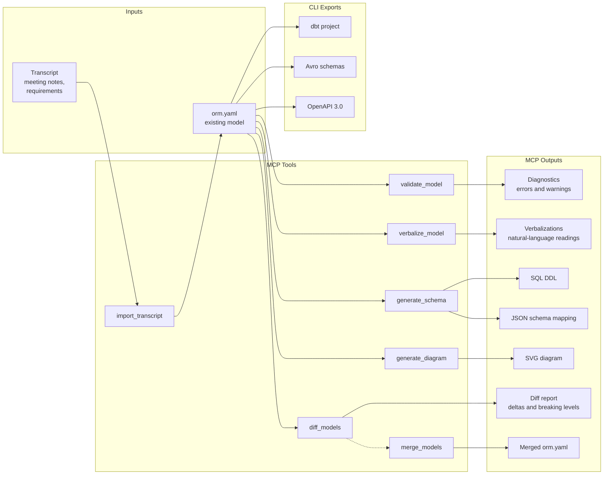

# Barwise MCP Server

MCP (Model Context Protocol) server that exposes barwise ORM 2 modeling
capabilities as tools, resources, and prompts. Any AI tool that speaks
MCP gets access to validation, verbalization, schema generation,
diffing, diagram generation, transcript import, and model merging.

---

## How It Works

The diagram below shows how barwise tools fit together. Inputs enter
from the left, flow through an ORM model in the center, and produce
output artifacts on the right.



**Typical flow**: start with a transcript or existing `.orm.yaml`,
validate it, verbalize to confirm domain semantics, then generate
artifacts. The MCP server produces DDL, JSON schema mappings, and SVG
diagrams directly. For dbt, Avro, and OpenAPI output, use the barwise
CLI (`barwise export dbt|avro|openapi`).

---

## Setup

### Option 1: VS Code Extension (recommended)

Install the **Barwise ORM Modeler** extension. All seven tools are
registered with VS Code's Language Model Tool API and appear
automatically in Copilot Chat -- no configuration needed.

You can reference any tool directly in Copilot Chat using `#`:

- `#barwiseValidate` -- validate a model
- `#barwiseVerbalize` -- verbalize fact types
- `#barwiseSchema` -- generate DDL or JSON schema
- `#barwiseDiff` -- compare two models
- `#barwiseDiagram` -- generate an SVG diagram
- `#barwiseImport` -- extract a model from a transcript
- `#barwiseMerge` -- merge two models

The extension also registers an MCP stdio server for external tools
that discover MCP servers through VS Code.

To disable both mechanisms, set `barwise.enableMcpServer` to `false` in
VS Code settings.

**LLM provider for transcript import**: The VS Code extension uses your
Copilot subscription by default -- no API key needed. To use Anthropic
instead, set `barwise.llmProvider` to `"anthropic"` and configure
`barwise.anthropicApiKey` in settings.

### Option 2: Standalone (Claude Code, Claude Desktop, Cursor, etc.)

For AI tools outside VS Code, run the MCP server via npx:

```
npx @barwise/mcp
```

No clone, no build, no extra dependencies.

**LLM provider for transcript import**: The standalone server requires
an LLM provider configured via environment variables:

- `ANTHROPIC_API_KEY` -- use Anthropic (Claude)
- `OPENAI_API_KEY` -- use OpenAI

If neither is set, the tool falls back to Ollama (local, no key
required).

#### Claude Code

Add to `.claude/settings.json` (project) or
`~/.claude/settings.json` (global):

```json
{
  "mcpServers": {
    "barwise": {
      "command": "npx",
      "args": ["@barwise/mcp"]
    }
  }
}
```

#### Claude Desktop

Add to `~/Library/Application Support/Claude/claude_desktop_config.json`
(macOS) or the equivalent on your platform:

```json
{
  "mcpServers": {
    "barwise": {
      "command": "npx",
      "args": ["@barwise/mcp"]
    }
  }
}
```

#### Cursor / Windsurf

Add to `.cursor/mcp.json` or `.windsurf/mcp.json` in your project:

```json
{
  "mcpServers": {
    "barwise": {
      "command": "npx",
      "args": ["@barwise/mcp"]
    }
  }
}
```

#### GitHub Copilot (VS Code -- without the extension)

If you prefer not to install the Barwise extension, add to
`.vscode/mcp.json` in your project:

```json
{
  "servers": {
    "barwise": {
      "type": "stdio",
      "command": "npx",
      "args": ["@barwise/mcp"]
    }
  }
}
```

Open Copilot Chat, switch to **Agent** mode, and the barwise tools will
appear in the tool picker.

---

## Common Workflows

These workflows show how to combine tools for typical tasks. You can
describe these goals in natural language to your AI tool and it will
invoke the right sequence of tools.

### Build a model from a transcript

> "Analyze this meeting transcript and extract an ORM model."

1. **import_transcript** -- extracts entity types, value types, fact
   types, and constraints from the transcript text
2. **validate_model** -- checks the extracted model for structural errors
3. **verbalize_model** -- generates natural-language readings so you can
   verify the model matches the domain

The `analyze-domain` prompt automates this sequence (see Prompts below).

### Review an existing model

> "Review my model at models/clinic.orm.yaml for quality."

1. **validate_model** -- surfaces errors and warnings
2. **verbalize_model** -- confirms fact type readings are natural and
   unambiguous
3. **generate_schema** -- verifies the relational mapping is reasonable
4. **generate_diagram** -- produces a visual overview

The `review-model` prompt automates this sequence (see Prompts below).

### Evolve a model incrementally

> "Merge the new model into the existing one and show me what changed."

1. **diff_models** -- compares old and new versions, shows added/removed/
   modified elements with breaking-level indicators
2. **merge_models** -- applies additions and modifications from the
   incoming model into the base, rejects removals
3. **validate_model** -- confirms the merged model is still valid

### Generate artifacts from a model

> "Generate DDL and a diagram from this model."

- **generate_schema** with `format: "ddl"` -- produces CREATE TABLE
  statements
- **generate_schema** with `format: "json"` -- produces a JSON mapping
  of tables, columns, keys, and foreign keys
- **generate_diagram** -- produces an SVG diagram with object types,
  fact types, constraints, and their relationships

For additional export formats, use the barwise CLI:

- `barwise export dbt <file>` -- generate a dbt project (schema.yml +
  model SQL files)
- `barwise export avro <file>` -- generate Avro schemas (.avsc files)
- `barwise export openapi <file>` -- generate an OpenAPI 3.0 spec

---

## Tools Reference

### validate_model

Validate an ORM 2 model and return structured diagnostics.

| Parameter | Type   | Required | Description                                              |
| --------- | ------ | -------- | -------------------------------------------------------- |
| `source`  | string | yes      | File path to an `.orm.yaml` file, or inline YAML content |

**Returns** JSON:

```json
{
  "valid": true,
  "errorCount": 0,
  "warningCount": 2,
  "errors": [],
  "warnings": [
    {
      "severity": "warning",
      "ruleId": "completeness/no-ref-scheme",
      "message": "Object type 'Employee' has no reference scheme"
    }
  ]
}
```

Each diagnostic includes a `severity` ("error" or "warning"), a
`ruleId` identifying the validation rule, and a human-readable
`message`.

---

### verbalize_model

Generate FORML natural-language readings for fact types and constraints.

| Parameter  | Type   | Required | Description                                              |
| ---------- | ------ | -------- | -------------------------------------------------------- |
| `source`   | string | yes      | File path to an `.orm.yaml` file, or inline YAML content |
| `factType` | string | no       | Name of a specific fact type to verbalize. Omit for all. |

**Returns** plain text, one verbalization per line:

```
Each Employee has exactly one EmployeeName.
Each Employee works for at most one Department.
Each Department has exactly one DepartmentName.
It is possible that more than one Employee works for the same Department.
```

Use this to verify that the model captures domain semantics correctly.
If a reading sounds unnatural, the model likely needs adjustment.

---

### generate_schema

Generate a relational schema (DDL or JSON) from an ORM model.

| Parameter | Type                | Required | Description                                              |
| --------- | ------------------- | -------- | -------------------------------------------------------- |
| `source`  | string              | yes      | File path to an `.orm.yaml` file, or inline YAML content |
| `format`  | `"ddl"` or `"json"` | no       | Output format. Defaults to `"ddl"`.                      |

**Returns** with `format: "ddl"`:

```sql
CREATE TABLE Employee (
  employee_name VARCHAR NOT NULL,
  department_name VARCHAR,
  CONSTRAINT pk_Employee PRIMARY KEY (employee_name)
);

CREATE TABLE Department (
  department_name VARCHAR NOT NULL,
  CONSTRAINT pk_Department PRIMARY KEY (department_name)
);
```

**Returns** with `format: "json"`:

```json
{
  "tables": [
    {
      "name": "Employee",
      "columns": [
        { "name": "employee_name", "type": "VARCHAR", "nullable": false }
      ],
      "primaryKey": ["employee_name"],
      "foreignKeys": []
    }
  ]
}
```

---

### diff_models

Compare two ORM models and return structural deltas.

| Parameter  | Type   | Required | Description                                               |
| ---------- | ------ | -------- | --------------------------------------------------------- |
| `base`     | string | yes      | File path or inline YAML for the base (original) model    |
| `incoming` | string | yes      | File path or inline YAML for the incoming (changed) model |

**Returns** JSON:

```json
{
  "hasChanges": true,
  "deltas": [
    {
      "kind": "added",
      "elementType": "object_type",
      "name": "Manager",
      "breakingLevel": "safe",
      "changeDescriptions": []
    },
    {
      "kind": "modified",
      "elementType": "fact_type",
      "name": "Employee works for Department",
      "breakingLevel": "caution",
      "changeDescriptions": ["Uniqueness constraint changed"]
    }
  ],
  "synonymCandidates": []
}
```

Each delta has a `breakingLevel`:

- **safe** -- additions that do not affect existing consumers
- **caution** -- modifications that may require consumer review
- **breaking** -- removals or changes that will break existing consumers

The `synonymCandidates` array flags cases where a removal and addition
may actually be a rename (e.g., "Customer" removed, "Client" added).

---

### generate_diagram

Generate an SVG diagram from an ORM model.

| Parameter | Type   | Required | Description                                              |
| --------- | ------ | -------- | -------------------------------------------------------- |
| `source`  | string | yes      | File path to an `.orm.yaml` file, or inline YAML content |

**Returns** SVG markup as text. The diagram shows:

- Entity types as rounded rectangles with reference modes
- Value types as dashed rounded rectangles
- Fact types as role boxes with reading labels
- Uniqueness, mandatory, frequency, and other constraints
- Subtype relationships as arrows
- Objectified fact types as nested containers

---

### import_transcript

Process a business domain transcript through LLM extraction to produce
a formal ORM 2 model.

| Parameter    | Type                                     | Required | Description                                                            |
| ------------ | ---------------------------------------- | -------- | ---------------------------------------------------------------------- |
| `transcript` | string                                   | yes      | Transcript text, or file path to a text/markdown file                  |
| `modelName`  | string                                   | no       | Name for the resulting model. Defaults to "Extracted Model".           |
| `provider`   | `"anthropic"`, `"openai"`, or `"ollama"` | no       | LLM provider (standalone only). Auto-detects from env vars if omitted. |
| `model`      | string                                   | no       | Model ID override, e.g. `"gpt-4o"` (standalone only).                  |

**Returns** annotated `.orm.yaml` content with:

- `# TODO:` comments where the extraction was uncertain
- `# NOTE:` comments with provenance from the source transcript
- Fully structured entity types, value types, fact types, and
  constraints

**VS Code**: uses Copilot by default (no API key). The `provider` and
`model` parameters are ignored; configure the LLM via
`barwise.llmProvider` and `barwise.copilotModelFamily` in VS Code
settings instead.

**Standalone**: requires `ANTHROPIC_API_KEY`, `OPENAI_API_KEY`, or a
running Ollama instance. Pass `provider` and `model` to override
auto-detection.

---

### merge_models

Merge an incoming ORM model into a base model. Accepts all additions
and modifications, rejects removals (non-interactive merge strategy).

| Parameter  | Type   | Required | Description                                                 |
| ---------- | ------ | -------- | ----------------------------------------------------------- |
| `base`     | string | yes      | File path or inline YAML for the base (original) model      |
| `incoming` | string | yes      | File path or inline YAML for the incoming model to merge in |

**Returns** JSON:

```json
{
  "yaml": "orm: '2.0'\nname: Merged Model\n...",
  "valid": true,
  "hasChanges": true,
  "errorCount": 0,
  "diagnostics": []
}
```

The `yaml` field contains the merged model. If `valid` is false, the
`diagnostics` array lists structural errors that should be resolved
before saving.

---

### query_model

Run a deterministic symbolic query against an ORM model. Unlike
`describe_domain` (a broad narrative summary), `query_model` answers one
precise structural question with a typed result and no LLM inference. AI
agents should prefer it over re-deriving answers from prior context.

| Parameter | Type   | Required | Description                                 |
| --------- | ------ | -------- | ------------------------------------------- |
| `source`  | string | yes      | File path or inline YAML for the model      |
| `query`   | string | yes      | A query DSL expression (see commands below) |

The `query` is one line: a command keyword followed by arguments. Names
containing spaces are double-quoted.

| Command                               | Answers                                       |
| ------------------------------------- | --------------------------------------------- |
| `entities [entity\|value]`            | All object types, optionally filtered by kind |
| `fact-types [<arity>]`                | All fact types, optionally filtered by arity  |
| `constraints [<type>]`                | All constraints, optionally filtered by type  |
| `entity <name>`                       | Full detail for one entity                    |
| `fact-type <name>`                    | Full detail for one fact type                 |
| `fact-types-of <entity>`              | Fact types an entity participates in          |
| `related-to <entity>`                 | Entities sharing a fact type with the entity  |
| `constraints-of <name>`               | Constraints touching an entity or fact type   |
| `subtypes-of <entity> [transitive]`   | Direct (or transitive) subtypes               |
| `supertypes-of <entity> [transitive]` | Direct (or transitive) supertypes             |
| `mandatory-roles [<entity>]`          | Mandatory roles, optionally for one entity    |
| `path <entityA> <entityB>`            | Shortest fact-type path between two entities  |
| `stats`                               | Element counts for the model                  |

**Returns** JSON:

```json
{
  "query": "fact-types-of Customer",
  "result": {
    "kind": "fact-types",
    "factTypes": [
      {
        "id": "ft-1",
        "name": "Customer places Order",
        "arity": 2,
        "reading": "Customer places Order"
      }
    ]
  },
  "text": "Fact types:\n  Customer places Order  [arity 2]"
}
```

The `result` field is a discriminated `QueryResult` (`kind` is one of
`entities`, `fact-types`, `constraints`, `roles`, `entity-detail`,
`fact-type-detail`, `path`, `stats`, or `not-found`). The `text` field
is a human-readable rendering of the same result. A well-formed query
against a missing element returns a `not-found` result; a malformed
query string returns an `error` field instead.

---

## Resources

### orm-schema://json-schema

The JSON Schema that defines the structure of `.orm.yaml` files. Useful
for understanding the model format or for configuring editor
validation.

### orm-model://{path}

Returns a deserialized ORM model from a file path as JSON. Allows AI
tools to inspect model contents programmatically without parsing YAML
themselves.

---

## Prompts

Prompts are pre-built multi-step workflows that guide the AI through
a sequence of tool calls. Use them by name in MCP-aware tools.

### analyze-domain

Guides the AI through analyzing a business domain transcript:

1. Identify entity types (things with identity)
2. Identify value types (attributes, measurements)
3. Discover fact types (relationships)
4. Identify constraints (uniqueness, mandatory, etc.)
5. Call `import_transcript` to extract the formal model

**Argument**: `transcript` -- the business domain text to analyze.

### review-model

Guides the AI through a quality review of an existing ORM model:

1. `validate_model` -- check for structural errors and warnings
2. `verbalize_model` -- verify readings are natural and unambiguous
3. `generate_schema` -- confirm the relational mapping is reasonable
4. Suggest improvements for completeness and clarity

**Argument**: `filePath` -- path to the `.orm.yaml` file to review.
