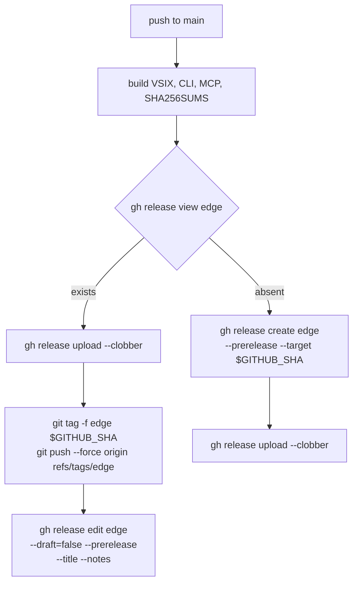

# The edge release must look as current as it is

Status: IMPLEMENTED and VERIFIED. All three acceptance criteria met on
the live repository after PR #531 merged at `3a1aed8f` (2026-09-22). The
experiment this shipped as has resolved in favour of keeping it; nothing
is reverted. See "What the first real run measured".
Created: 2026-09-22
Last-updated: 2026-09-22
Tracking: barwise-1047. Revises the edge-build half of
`docs/specs/archive/release-pipeline.spec.md` (2026-06-17), and reverses
`cf748238`, "ci: stop moving the edge tag (it breaks git pull)".

In one sentence: the rolling `edge` build works and has worked all
along, but its tag has been frozen at a June commit since `cf748238`, so
the releases page files it below three versioned releases under a date
six weeks older than its own assets -- and the owner read that as the
build having stopped, which is the only test of a download page that
matters.

## Principle

**A gate that cannot see its input must not print PASS**
(`docs/specs/gate-refusal-contract.spec.md`) is about instruments. This
is the same failure one layer out, in a page rather than a script: the
edge release reports a state it is not describing. The assets are from
yesterday; everything around them -- position in the list, published
date, the tag a reader would click -- says June. A reader cannot tell
"current build" from "abandoned build", and the ambiguity resolved the
wrong way.

It is also **the shadow and the property**. "Published date" is a cheap
observable that correlates with "these artifacts are fresh" through a
mechanism: normally a release is published once, when its artifacts are
built. The edge release bypasses that mechanism by design -- artifacts
are replaced in place under a release that is never republished -- so
the shadow diverges from the property exactly where the mechanism is
gone. The divergence was there from the first refresh; nothing had to be
gamed.

## What is actually broken (measured 2026-09-22)

**Not the build.** The Release workflow ran on every push to `main`; the
last ten runs all succeeded. The most recent built `a3d853d4` at
2026-09-21T20:17Z, which is the last commit on `main`. Downloading
`barwise-cli-edge.cjs` gives a bundle whose SHA-256 matches the digest
the API reports, which contains the `--api-key was removed` refusal
string added on 2026-09-12, and which behaves identically to a local
build of current `main`.

**The tag.** `refs/tags/edge` points at `04265738`, a merge from
2026-06-14. A GitHub release is bound to its tag, so the page files edge
**fourth**, below `v1.7.0`, `v1.6.1` and `v1.6.0`, under a published
date of **2026-08-07**.

`cf748238` anticipated exactly this and tried to compensate by putting
the build date in the title -- "Edge build a3d853d (2026-09-21)". That
mitigation is still in place and it failed: the title is text, the
ORDERING is what a reader scans, and the owner concluded the build had
stopped.

## The reversal, and why the original reason does not hold

`cf748238` froze the tag because "a moving tag makes every contributor's
`git pull` fail with 'would clobber existing tag', which aborts the
fetch so main never updates." Measured on git 2.43.0, against a scratch
origin and a clone with the tag moved underneath it:

| Invocation                                          | Result                                          |
| --------------------------------------------------- | ----------------------------------------------- |
| `git pull` / `git fetch` (plain)                    | **exit 0**, main fast-forwards, local tag stale |
| `git fetch --tags` / `git pull --tags`              | exit 1, `! [rejected] edge -> edge`             |
| `fetch.prune` + `fetch.pruneTags`                   | exit 1 -- makes even a PLAIN pull fail          |
| `remote.origin.fetch += '+refs/tags/*:refs/tags/*'` | **exit 0**, `t [tag update]`                    |
| `git fetch --tags --force`                          | **exit 0**, `t [tag update]`                    |

Auto-tag-following ADDS tags absent locally; it never clobbers one that
exists, it skips it. So a plain `git pull` does not fail and main does
update -- the recorded symptom is not what a plain pull does. The cost
falls only on explicit `--tags` invocations, and one per-clone config
line removes even that, permanently:

```
git config --add remote.origin.fetch '+refs/tags/*:refs/tags/*'
```

Two honest limits. This was measured on **git 2.43.0 only**; the June
session may have been on another version, or have reached it through a
`--tags` invocation and generalised, and neither is recoverable now.
And `fetch.pruneTags` being _worse_ is the reason this table exists
rather than a recommendation: it was the mitigation this spec was going
to propose until it was run.

## What the first real run measured (2026-09-22)

Release run 381, on the `#531` merge commit `3a1aed8f`. Every criterion
checked against the live repository with the value read directly, not
inferred from the workflow succeeding.

Every number below comes from one of these three, re-runnable against
the live repository (`pr-review/checklist.md`, "Every number in the body
has the command that produced it"):

```
git ls-remote origin refs/tags/edge                       # criterion 1
gh api repos/semantic-praxis/barwise/releases \
  --jq '.[] | {tag_name, name, created_at, published_at}' # criterion 2, in list order
gh api repos/semantic-praxis/barwise/releases/tags/edge \
  --jq '{created_at, published_at, updated_at, target_commitish,
         assets: [.assets[] | {name, created_at}]}'       # the step ordering
```

The criterion-3 commands are inline with its evidence below. This
session read the release endpoints through the GitHub MCP tools rather
than `gh`; the `gh` spellings above are the equivalent a reader can run,
and were not themselves executed here.

**1. The tag moves.** `git ls-remote origin refs/tags/edge` returned
`3a1aed8f` within ten seconds of the run starting, against `04265738`
before. Met.

**2. The releases page reorders. MET, and this was the one that could
not be predicted.** Edge now lists **first**, above `v1.7.0`, from
fourth before.

The mechanism, now that there is evidence for it: `published_at` did
**not** move -- it is still `2026-08-07T11:46:23Z`, frozen where it has
always been -- while `created_at` went from `2026-06-14T21:45:35Z` to
`2026-09-22T18:40:50Z`, which is the new tag's commit. So the listing
follows the tag, through `created_at`, and the publish date is
irrelevant to it. That also explains why the title-carries-the-date
mitigation could never work: it addressed the text, and position is what
a reader scans.

Stated carefully, because the earlier reading was wrong in this spec's
first draft: `created_at desc` alone does not explain the whole
historical ordering (before the move, edge's `created_at` of 21:45:35
was LATER than `v1.6.0`'s 21:10:58, yet the page listed `v1.6.0` above
it). What is established is the causal chain -- move the tag, and
`created_at` follows it, and the position changes -- not the complete
sort rule. Do not build anything on a sharper claim than that.

**3. A plain `git pull` is unaffected.** The first attempt at this
evidence ran `git fetch origin main`, which proves the transfer and NOT
the criterion -- the criterion says a plain pull exits 0 AND updates
`main`, and a fetch updates no branch. Re-run properly, reproducing a
contributor's clone made before the tag moved (stale tag, branch
behind):

```
git clone https://github.com/semantic-praxis/barwise.git c && cd c
git tag -f edge 04265738      # a clone taken before the move
git reset --hard HEAD~2       # and a branch behind the remote
git pull

  BEFORE   main=a886f1ae  edge=04265738
  remote   main=3a1aed8f  edge=3a1aed8f

  Updating a886f1ae..3a1aed8f
  Fast-forward
   13 files changed, 1171 insertions(+), 53 deletions(-)
  EXIT=0

  AFTER    main=3a1aed8f  edge=04265738
```

`main` fast-forwarded, the stale local tag was left alone, exit 0. And
separately, the explicit form is rejected as documented:

```
git fetch --tags origin   EXIT=1   ! [rejected] edge -> edge (would clobber existing tag)
```

So the scratch-repo measurements hold in production, and what
`README.md` and the release skill tell contributors is verified rather
than argued.

**The reordered step worked.** Asset `created_at` is 18:41:47-48, the
tag moved next, and the release's `updated_at` is 18:41:51 -- upload,
then tag, then metadata, in that order. The failure-safety argued for in
review is therefore the real behaviour, though no failure occurred to
exercise the safe half-done state.

**One thing did not update and does not matter:** `target_commitish`
still reads `04265738`. GitHub does not refresh it for an existing
release, and nothing consumes it -- the tag ref, the assets and the
listing are all correct.

## Scope

In scope: moving `refs/tags/edge` to the built commit on every push to
`main`, in `release.yml`; recording the contributor-side config above
where a contributor will find it.

Out of scope: deleting and recreating the release per build (it
notifies every watcher on each merge -- roughly 216 a month at this
merge rate -- and 404s the download briefly); versioned releases, which
stay intentional and untouched; any change to what is built or to the
asset names.

## Target architecture

The one changed step, in the `push` branch of `release.yml`:



**Assets first, then the tag.** This diagram originally showed the tag
moving first; a review of the implementing pull request pointed out that
a failed upload then leaves `edge` naming a commit whose tag-relative
artifacts are the PREVIOUS build, and a consumer downloads artifacts
that do not match the tag they asked for. Uploading first inverts the
failure into current bundles under a lagging tag -- exactly the state
this repository sat in for three months, cosmetic, and fixed by the next
successful run.

**That failure path has never been exercised.** Release run 381
succeeded, which establishes the ORDER (see the timestamps below) and
says nothing about what a failure does. The safety is argued from the
ordering, not measured.

The first-run branch has no window at all: `gh release create --target`
mints the tag itself.

Asset download URLs are tag-relative
(`releases/download/edge/barwise-cli-edge.cjs`) and survive a tag move,
so nothing linking to an edge asset breaks.

## Alternatives considered

**Recreate the release each build.** Refreshes `created_at` and
`published_at`, so it almost certainly fixes the ordering. Rejected on
cost: a release notification to every watcher on every merge, and a
window where the download 404s. Offered to the owner and declined.

**Leave the mechanism, fix the signal** -- surface the build commit and
date more prominently, point the README at the stable asset URLs so
nobody navigates by the releases page. Rejected because it is what
`cf748238` already tried, and it demonstrably did not work on the one
reader who matters.

**Keep the tag frozen, add a second moving tag.** Two tags for one
release is a must-agree pair with nothing checking it, and the release
can only bind to one of them anyway.

## Workstream

**WS1 -- Move the tag.** Add the `git tag -f` / `git push --force` step
above to `release.yml`'s push path, and record the contributor config
line in the release skill. Acceptance, all three checked directly and
not inferred:

1. After the next merge, `git ls-remote origin refs/tags/edge` returns
   that merge commit, not `04265738`.
2. **The releases page shows edge above the versioned releases.** The
   part that could not be predicted before merging: the pre-merge
   reading was that the sort key was neither `created_at` nor
   `published_at` (edge's `created_at` was 2026-06-14T21:45:35Z,
   v1.6.0's is 21:10:58Z, and the page nonetheless listed v1.6.0 above
   edge). So it was to be observed on the live page, with the change
   reverted if the position did not move.
3. A plain `git pull` in an existing clone still exits 0 and still
   updates `main`.

**ALL THREE MET on 2026-09-22 -- see "What the first real run
measured", which supersedes the contingency here.** The criteria are
left in their original wording as the record of what was promised
before the evidence existed; criterion 2's pre-merge reading of the sort
key is corrected in that section, not here.

## Risks

**The position may not move, and then this bought a moved tag for
nothing.** RESOLVED 2026-09-22: it moved, from fourth to first. The
mitigation (one step, trivially revertible, gated on criterion 2) was
never needed, and the risk is retained as the record of what was
uncertain.

**A contributor who runs `git fetch --tags` gets a rejection until they
add the config line.** Measured, bounded, and one line to fix. This
repository's other clones are ephemeral session containers that clone
fresh and never hold a stale tag.

**`git push --force` on a tag, in CI, with `contents: write`.** Scoped
to the literal ref `edge` by the command itself. It cannot reach a
version tag without the line being edited, which is a diff a reviewer
sees.

## Open decisions

None open. The owner chose the approach, and criterion 2 -- which
decided whether it stays -- was met on the live page on 2026-09-22.

One thing is deliberately NOT claimed: the failure-safety of the
upload-then-tag ordering. Run 381 succeeded, so the half-done state that
ordering exists for has never occurred. That is an argued property, not
a measured one, and the Target architecture section says so.
