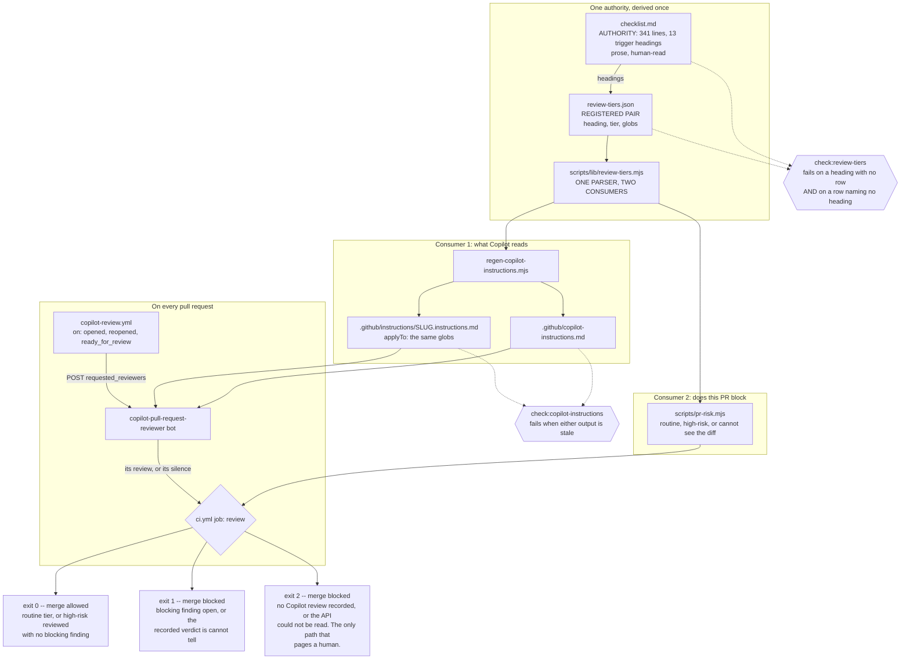

# Tiered PR review: Copilot on every PR, a blocking tier for the changes that carry liability

Status: WS2 IMPLEMENTED (the tier table, its shared parser, and
`check:review-tiers`, wired into ci.yml). WS1's precondition is SETTLED
(Copilot code review works here; see "What the live test measured") but
WS1 is NOT built -- its cost question is open. Open decision 2 is
RESOLVED against this spec's own recommendation; Open decision 5's model
half is decided (the org Copilot policy now enables only GPT-5.6 Terra)
and its cost half is open. WS3, WS4 and WS5 are unbuilt.

Created: 2026-09-17
Last-updated: 2026-09-18
Tracking: barwise-1036 (WS1, the Copilot review workflow); barwise-1037 (WS2,
the tier table and its completeness gate); barwise-1038 (WS3, the
classifier); barwise-1041 (WS4, the blocking gate); barwise-1040 (WS5,
generated instructions and the measurement). Closes nothing on its own.
The finding is barwise-953 (the instance: PR skills exist, are discoverable,
and are not invoked -- two recorded occurrences, and now the steady
state). Extends `docs/specs/pr-skills.spec.md`, which wrote the review
down, and applies `docs/specs/gate-refusal-contract.spec.md`, which is
the reason the gate here has three results instead of two.

In one sentence: every pull request gets a Copilot review driven by
repository instructions generated from the files that already own the
rules, a path-derived tier decides whether that review blocks the merge,
and a reviewer that could not answer blocks too -- because "found
nothing" and "did not run" must not look the same.

## Principle

**Define errors out of existence**, pointed at the review itself.

`pr-skills.spec.md` gave this repository a review discipline that works.
Its one run on PR #475 disproved the PR's own central behavioural claim
with a single CLI command -- the class of defect no gate in `ci.yml` can
reach. The discipline is not the problem.

The problem is that invoking it is a caller's responsibility. barwise-953
records two occurrences and states the remedy that was tried and failed:
"A restatement in prose that the skills should be run does NOT close this
-- that is what exists now, and it has a 0-for-2 record." Measured across
eight merged pull requests sampled on 2026-09-17, seven carry no recorded
review of any kind; the eighth is PR #475, the skill's own first run. Over
the preceding thirty days 216 pull requests merged, several within three
minutes of opening. The finding has stopped being an incident.

A caller who must remember to ask for a review is the failure case to
design away. The review becomes a thing that happens to a pull request
rather than a thing someone starts.

**Explicit over implicit** decides where the rules live. Copilot cannot
know barwise's invariants, and the 341 lines that state them already have
exactly one home in `pr-review/checklist.md`. Restating them for Copilot
creates the must-agree copy CLAUDE.md forbids, so the instructions
Copilot reads are generated from that file and a drift gate fails when
they diverge.

## Should the review gate trust a silent Copilot? (resolved: no -- it refuses)

A review check that passes when Copilot posted nothing is the defect
`gate-refusal-contract.spec.md` spent a month removing, one layer out.

Copilot reviewing a diff and finding nothing, and Copilot never running
because the request failed, the bot was unavailable, or the API read
returned empty, produce the same observable: no findings on the pull
request. A gate that reads "no findings" as "pass" prints PASS on a
question it never asked. That is barwise-906's shape -- six occurrences
-- and `audit-gate`'s false green, which is the one the fault matrix
caught.

So the gate has three results, the same three every other gate here has:

| Situation                                                    | Exit | Merge   |
| ------------------------------------------------------------ | ---: | ------- |
| Routine tier                                                 |    0 | allowed |
| High-risk tier, Copilot reviewed, no blocking finding        |    0 | allowed |
| High-risk tier, blocking finding open                        |    1 | blocked |
| Recorded barwise verdict is "cannot tell"                    |    1 | blocked |
| No Copilot review recorded, or the API could not be read     |    2 | blocked |
| Copilot responded that it could not review (quota exhausted) |    2 | blocked |

Exit 2 is not a failure of the pull request. It is the gate saying it
could not see its input, which is the signal that routes to a person --
and it is the only path in this design that pages one. The paper this
was argued from proposes calibrated abstention as the mitigation for
agent false negatives; this repository already built abstention for its
gates, and this spec extends it to the reviewer.

## Should the tier table live inside checklist.md? (resolved: no -- a registered pair)

`checklist.md`'s section headings already are the risk triggers: "When a
surface changed", "When `@barwise/core` changed", "When a skill, agent
brief, CLAUDE.md, AGENTS.md, or prompt artifact changed". What they lack
is a machine-readable path.

Putting globs into `checklist.md` keeps one owner at the cost of the
document a human actually reads. The alternative -- a table that names
the headings -- is a copy, so it gets the treatment CLAUDE.md prescribes
for copies: register the pair and make agreement loud. `review-tiers.json`
names each heading verbatim and carries its globs, and
`check:review-tiers` fails **both** on a heading with no row and on a row
naming a heading that no longer exists. That bidirectional shape is
`check:root-scripts`, which already fails both ways for the same reason.

One derivation then feeds two consumers: the tier classifier reads it to
decide whether a pull request blocks, and the Copilot instruction
generator reads it to emit path-scoped instructions. Two parsers over one
table would be the copy the rule forbids, so the table is parsed once in
`scripts/lib/review-tiers.mjs` -- the shape `lib/ci-gates.mjs` already
uses for `ci.yml`.

## What the live test measured (2026-09-18)

The precondition WS1 was blocked on is **settled positive**, and the same
run answered Open decision 2, falsified this spec's recommendation on it,
and surfaced a cost the design had not priced.

Copilot code review was requested on PRs #516 and #509 across two windows,
before and after the org's Copilot entitlement was enabled. Five responses
from `copilot-pull-request-reviewer[bot]`:

| Time (UTC) | PR   | Response                           |
| ---------- | ---- | ---------------------------------- |
| 01:33:08   | #516 | "unable to review ... quota limit" |
| 01:33:54   | #509 | "unable to review ... quota limit" |
| 01:34:00   | #516 | "unable to review ... quota limit" |
| 01:36:08   | #516 | "unable to review ... quota limit" |
| 01:39:34   | #516 | a real review                      |

**The false green this spec was written around occurred in the wild, four
times, within hours of it merging.** Those first four are `state:
COMMENTED` reviews authored by the reviewer bot. A gate asking "did
Copilot post a review on this head?" passes on every one of them. The
review says, in its own body, that it did not review. That is not a
hypothetical the refusal contract was guarding against -- it is the
observed default behaviour of this reviewer under a condition
(exhausted quota) that recurs monthly by construction.

**Open decision 2 is resolved, against this spec's own recommendation.**
The spec recommended treating `CHANGES_REQUESTED` as the blocking signal
and leaving comments advisory. That cannot work: **all five responses
carry `state: COMMENTED`**, including the real review, whose body opens
with an approval recommendation. Copilot does not vary its review state.
The signal is in the body, not the state, and a gate reading `state`
would have been reading a constant. The recommendation was made without a
corpus, and one run of the corpus disproved it.

What the body does carry, in the real review, is structure:

- A verdict line -- an approval recommendation, prefixed with a coloured
  status marker.
- A details block with `Files reviewed: 1/2 changed files`,
  `Comments generated: 0 new`, `Review effort level: Balanced`, and a
  `Files not reviewed` list naming each skipped file with a reason
  (`barwise/package-lock.json: Generated file`).

Copilot self-reports its own coverage. That is a stronger signal than
this spec designed for: the gate can detect a review that covered almost
nothing, not merely one that did not happen.

**It does not run your gates.** The real review recommended approval on
#516, whose CI has been red since 2026-09-12. A Copilot approval is
evidence a reviewer looked, never evidence the change is sound, which is
why the review job reads tier, CI and review state together.

**The cost the design had not priced. (UNVERIFIED -- confirm before
acting on it.)** Secondary sources report that Copilot code review
carries a premium-request multiplier of 13 from 2026-06-01, and that on
private repositories it additionally consumes Actions minutes from the
same pool as CI. **This spec has not verified either figure**:
`docs.github.com` is unreachable from the session that wrote this
section (blocked by the network egress proxy), so the numbers come from
search-result summaries rather than from GitHub's billing documentation,
and no command in this repository reproduces them. Whether this
repository is private in GitHub's sense is also unestablished -- the
`"private": true` in `barwise/package.json` is the npm publish flag
and says nothing about repository visibility.

If the multiplier of 13 holds, then at this repository's measured rate
of 216 merged pull requests a month (`git log --merges --since="30 days
ago" --format="%s" | grep -c '^Merge pull request'`), "Copilot reviews
every pull request" is on the order of 2,800 premium requests a month
before a single Chat or agent call. That conditional is the whole of the
cost argument, and it rests on a number nobody here has checked against
its source. Verify it first; it may invert WS1's central choice.

## Scope

In scope:

- When a pull request is opened, reopened, or marked ready for review,
  the system shall request a Copilot code review on it.
- When `.github/copilot-instructions.md` or any file under
  `.github/instructions/` differs from its regenerator's output,
  `npm run check:copilot-instructions` shall exit 1 and name the stale
  file.
- When a regenerator or gate in this spec cannot read `checklist.md`,
  `review-tiers.json`, or the changed-file list, it shall exit 2 and
  shall not print a tier or a verdict.
- When a diff touches a glob in `review-tiers.json`, `scripts/pr-risk.mjs`
  shall classify the pull request as high-risk and print every triggering
  heading.
- When a heading in `checklist.md` has no row in `review-tiers.json`, or
  a row names a heading absent from `checklist.md`,
  `npm run check:review-tiers` shall exit 1.
- When a high-risk pull request has no Copilot review recorded on its head
  commit, the review gate shall exit 2.
- When a high-risk pull request carries an unresolved blocking finding, or
  a recorded barwise verdict of "cannot tell", the review gate shall exit 1.

Out of scope:

- **Running the `pr-review` skill in CI.** It needs a model, and a model
  needs a key, and `docs/specs/keyless-model-access.spec.md` removed the
  places a key can sit. Copilot is the keyless reviewer; the deep review
  stays a session activity whose verdict this gate reads. Revisit only if
  the measurement in WS5 shows generated instructions cannot carry the
  invariants.
- **Retiring any `ci.yml` gate.** Nothing here replaces a deterministic
  check. `checklist.md` is scoped by construction to what CI cannot reach.
- **Enforcing the required check.** Branch protection is a repository
  setting, not a file. See Open decisions.

## Inventory

| File                                    | Current state                                                        | Verdict                                                                                                                         |
| --------------------------------------- | -------------------------------------------------------------------- | ------------------------------------------------------------------------------------------------------------------------------- |
| `.claude/skills/pr-review/checklist.md` | 341 lines, 13 trigger headings, prose                                | authority; gains no globs, gains a completeness gate                                                                            |
| `.github/copilot-instructions.md`       | 31 hand-written lines, all about ORM tool usage, no review guidance  | becomes generated; current content is preserved as a hand-authored preamble section                                             |
| `.github/instructions/`                 | absent                                                               | new: one generated `*.instructions.md` per tier heading                                                                         |
| `.github/workflows/ci.yml`              | one `ci` job; inline path classification for docs-only and optimizer | gains a `review` job; the two existing classifiers stay as they are                                                             |
| `barwise/scripts/lib/ci-gates.mjs`      | parses `ci.yml` into the gate list                                   | untouched; the model this spec copies                                                                                           |
| `barwise/parity.manifest.json`          | 8 declared sets, byte-checked                                        | untouched -- the generated pair is guarded by a regenerator and a drift gate, which the rule accepts in place of a manifest row |
| `barwise/audit-baseline.json`           | duplication ratchet                                                  | untouched, but WS3 must classify any candidate the new scripts raise                                                            |

Nothing in `packages/` changes. This spec touches repository process only,
which is why no workstream below runs the monorepo build for its own sake.

## Target architecture

The shape to check is the fan-out in the middle and the fan-out at the
end: one authority derived once into one parser that two consumers read,
and one gate with three results rather than two.

The dotted edges are checks, not data flow: `check:review-tiers` reads
both `checklist.md` and `review-tiers.json` because it fails in both
directions, and `check:copilot-instructions` reads the generated outputs
to fail when they are stale. The edge from the bot to the gate is
labelled "its review, or its silence" because those two are the same
observable, which is what the third exit code exists to separate.

## Alternatives considered

- **A hand-written `copilot-instructions.md` that restates the
  checklist.** Fastest, and it is the thing CLAUDE.md names as the
  failure: an unchecked must-agree copy. The checklist changes when an
  invariant is learned, and the copy would not, so Copilot would be
  reviewing against last month's rules with nothing to say so.

- **Blocking only on abstention, never on the tier.** Cheaper in merge
  latency and it still closes the false-green hole. Rejected by the
  requester in favour of blocking the whole high-risk tier: an open
  blocking finding on a change to `core`'s public API should not merge
  because the reviewer was confident about it. The cost is real and is
  stated in Risks.

- **Run `pr-review` in GitHub Actions via a model API.** Closes
  barwise-953 at the root with no reliance on Copilot absorbing generated
  instructions. It puts a second credential-holding lane in the
  repository against `keyless-model-access.spec.md`, which deliberately
  left exactly one. Held in reserve for WS5's measurement.

- **Enable automatic Copilot review in repository settings.** One toggle,
  no code. Invisible to the tree: nothing in a diff shows it exists, and
  no gate can assert it is still on. Rejected on the same ground the
  requester chose a workflow file.

## Workstreams (each independently shippable)

**WS1 -- Copilot reviews every pull request. Its precondition is NOT
established.** Requesting a Copilot review on PR #525 on 2026-09-17
produced no review in over eight hours, and nothing available
distinguishes "Copilot code review is disabled for this repository" from
"the request silently failed" (barwise-1036). Establish that Copilot code
review is enabled here and posts, BEFORE building the workflow: if it is
not, WS1 cannot ship, the first tier of this design is empty, and WS3 and
WS4 are moot. Then add
`.github/workflows/copilot-review.yml` requesting
`copilot-pull-request-reviewer[bot]` as a reviewer on `opened`,
`reopened`, `ready_for_review`. No gate, no tier, nothing blocks. This
ships value on its own and produces the review corpus WS5 measures.
Acceptance: a pull request opened after this lands carries a Copilot
review, observed, with the request visible in the workflow log.

**WS2 -- The tier table and its completeness gate. (IMPLEMENTED
2026-09-18.)** `barwise/review-tiers.json`, `scripts/lib/review-tiers.mjs`,
`scripts/check-review-tiers.mjs`, `npm run check:review-tiers`, wired into
`ci.yml` so `ci-local` derives it. Seven tests in
`scripts/tests/gates.test.mjs`. The acceptance criterion was met: the gate
was watched going red on the real files first -- exit 1 on a planted
heading with no row, exit 1 on a renamed heading leaving a stale row,
exit 2 on a checklist moved out of reach (moved rather than chmod, since
the session runs as root and 000 does not stop it) -- each exit status
read directly with nothing in between, then the checklist restored
byte-identical and the gate green again. The tests pin the same four
readings against fixtures, through `--checklist`/`--table` overrides that
exist so the suite never perturbs the live checklist.

**What WS2 found that this spec assumed away: three of thirteen headings
are not path-shaped.** "When a type was introduced, or a field's type
chosen", "When a module, function, or interface was introduced, or a
signature widened" and "When a copy was added or a copy was edited"
trigger on what a hunk DOES, not where it lives; a copy is a relation
between two files, which no single-path glob expresses. Forcing them a
glob would mean matching every `.ts` file, making almost every code
change high-risk and blowing WS3's distribution budget on a rule nobody
believes. They carry tier `not-path-derivable` instead: the row exists so
the completeness gate still accounts for the heading, and the tier says
in the artifact that the classifier cannot reach it and the deep review
still owns it. This is the spec's "explicit over implicit" rather than a
gap -- but it does mean the tier can never be the whole of the checklist,
and WS4 must not read a routine classification as "the checklist is
satisfied".

**WS3 -- The classifier.** Add `scripts/pr-risk.mjs` over
`review-tiers.mjs`, plus `test:scripts` coverage. Prints the tier and
every triggering heading; exits 2 when it cannot obtain the changed-file
list. Acceptance: classifies the last 20 merged pull requests, and the
distribution is reported in this spec's revision -- if high-risk exceeds
roughly a third, the globs are wrong and WS4 does not proceed.

**WS4 -- The blocking gate.** Add the `review` job to `ci.yml` reading
the pull request's reviews through the API, with the five-row table
above as its contract. Acceptance: watched producing each of 0, 1 and 2
on a real pull request before it is made required.

**WS5 -- Generated Copilot instructions, and the measurement that decides
whether they work (provisional: not yet grounded).** Add
`scripts/regen-copilot-instructions.mjs` and
`npm run check:copilot-instructions`. The generated instructions cannot
be unit-tested -- the reviewer is a third party and its output is not
deterministic -- so this workstream's real deliverable is a measurement:
plant a known checklist violation in a scratch pull request, one per
tier heading, and record whether Copilot flags it. A heading Copilot
misses is a heading the deep review still owns, recorded in this spec
rather than assumed away.

Coupling: WS4 depends on WS3, which depends on WS2. WS1 and WS5 are
independent of all three; WS1 should land first because WS5 needs its
corpus.

## Risks

**Blocking the tier makes roughly one or two pull requests a day wait.**
At 216 merges in thirty days, a tier catching a third of them is about
two per day held until a review is recorded. That is the requester's
decision and the point of the design, but it is also the shape that gets
gates disabled. WS3's distribution check exists to catch a tier that is
too wide before WS4 makes it binding.

**Copilot finding nothing is a shadow, not a property.** It correlates
with the diff being clean through a mechanism -- Copilot read the diff
and had an opinion -- and diverges exactly where the mechanism is bypassed:
instructions too long to absorb, a pointer to `checklist.md` it did not
follow, a diff too large for its context. The gate can verify Copilot
_answered_; nothing in this design verifies it answered _well_. WS5 is
the instrument, and its findings belong in this spec, not in a comment.

**The whole design rests on a third-party capability this spec has not
seen work.** Every tier, gate and generated instruction below assumes
Copilot code review runs on this repository. One measurement exists and
it is negative: no review in eight hours from an explicit request. That
is not evidence Copilot is unavailable -- it is evidence the question is
unanswered, which is the weaker position of the two. WS1 exists to settle
it first, and no later workstream should be built on the assumption until
it is.

**Prompt injection reaches the reviewer.** Copilot reads diff content,
and a pull request can contain text addressed to it. This is an
unsolved class, acknowledged as such in the literature. It bounds what
the gate may conclude: a Copilot review is evidence that a review
happened, never authority to merge. The high-risk tier ends at a human,
which is what keeps that bound meaningful.

## Open decisions

1. **Where required-check enforcement is recorded.** Branch protection is
   a repository setting; nothing in the tree shows it exists or is still
   on -- the objection that decided WS1's mechanism. Options: (a) accept
   it and document it in CLAUDE.md; (b) add a gate that reads the
   repository ruleset through the API and fails when the `review` check
   is not required. **Recommended: (b).** The repository's own standard
   is that a convention with no check is not landed, and (a) recreates
   for enforcement the exact hole the requester rejected for Copilot.
   The cost is a gate that needs network and a token, so it refuses with
   exit 2 offline -- which is the contract working, not a defect.

2. **What counts as a blocking finding from Copilot. (RESOLVED
   2026-09-18, against this spec's own recommendation.)** The
   recommendation was (b): treat `CHANGES_REQUESTED` as blocking, leave
   comments advisory. Measurement disproved it -- Copilot returns
   `state: COMMENTED` invariantly, including on the review whose body
   recommends approval and on the four that say it could not review. A
   gate reading `state` reads a constant. The signal is the body's
   verdict line, and the `Files reviewed: N/M` and `Files not reviewed`
   fields beside it. WS4 parses the body; it must not branch on review
   state. See "What the live test measured".

3. **Where a barwise deep-review verdict is recorded so a gate can read
   it.** The "cannot tell" row needs a machine-readable home. Options:
   (a) a review posted through the API whose first line carries the
   verdict, parsed by the gate; (b) a `review-verdict.json` committed to
   the branch; (c) a label. **Recommended: (a).** The `pr-review` skill
   already specifies the recommendation as the first line of the review
   body, so the format exists and needs no second authority -- but it
   makes the gate a parser of prose, which is the weak part of the
   recommendation and the reason this is open rather than decided.

4. **Whether `.github/instructions/*.instructions.md` path-scoped
   instructions are supported by Copilot code review at the time WS5
   lands.** The mechanism is documented for Copilot, and its `applyTo`
   globs map onto the tier table exactly, which is why the architecture
   reaches for it. It is a third-party capability and this spec has not
   verified it. WS5 grounds it first and falls back to a single generated
   `copilot-instructions.md` if path scoping is unavailable.

5. **Which model tier reviews, and whether the tier gates requesting as
   well as blocking.** Published figures for the GPT-5.6 family: Sol
   $5/$30 per 1M tokens, Terminal-Bench 2.1 88.8%, Nerova 79.2%; Terra
   $2.50/$15, 87.1%, 71.4%; Luna $1/$6, 83.2%, 41.3%. Context is 1.05M on
   all three, so the instruction-absorption risk this spec worried about
   -- 341 checklist lines plus generated instructions -- does not
   discriminate between them. (Figures as supplied by the repository
   owner from the model picker, 2026-09-18; not independently verified
   against a vendor publication.) **The model half is DECIDED as of
   2026-09-18: the org Copilot policy enables only GPT-5.6 Terra.** That
   also closes the model-provenance gap by construction -- if only Terra
   can run, every Copilot review was Terra, and WS4 never needs to assert
   it. The closure is an INFERENCE, not an observation: it holds only if
   code review honours the org model policy, which is unverified, and the
   review body does not name the model, so the artifact cannot settle it
   either way. The cost half below stays open. **Recommended: Terra.** Luna is
   disqualified by the SPREAD rather than by either score: it trails
   Terra by 3.9 points on Terminal-Bench and by 30.1 on Nerova, and two
   benchmarks disagreeing by 26 points about the same model means one of
   them is insensitive to something Luna lacks. Which one is relevant to
   reviewing a diff against a written checklist is not established here
   -- what this spec has is the shape, not a reading of Nerova -- and a
   reviewer that gates merges is the wrong place to bet on the
   optimistic benchmark. Terra is within 1.7 points of Sol on
   Terminal-Bench at half the token price.

   Two things this recommendation does NOT settle. First, Copilot bills
   by premium request with a per-model multiplier, not by token, so the
   prices above may not drive Copilot cost at all -- confirm whether the
   13x code-review multiplier varies by tier before treating Terra as
   the cheap option. Second, at 13x and roughly 216 merged pull requests
   a month, reviewing every pull request is on the order of 2,800
   premium requests monthly; if that is not affordable, the tier must
   gate **requesting** and not only blocking, which inverts WS1's
   "every pull request" premise. That is the decision, and it is a
   budget question this spec cannot answer.

   WS5 settles the capability half empirically: run the planted
   checklist violations at Terra and at Luna and compare. The benchmarks
   say Luna is risky; only WS5 says whether that matters for these
   invariants.
