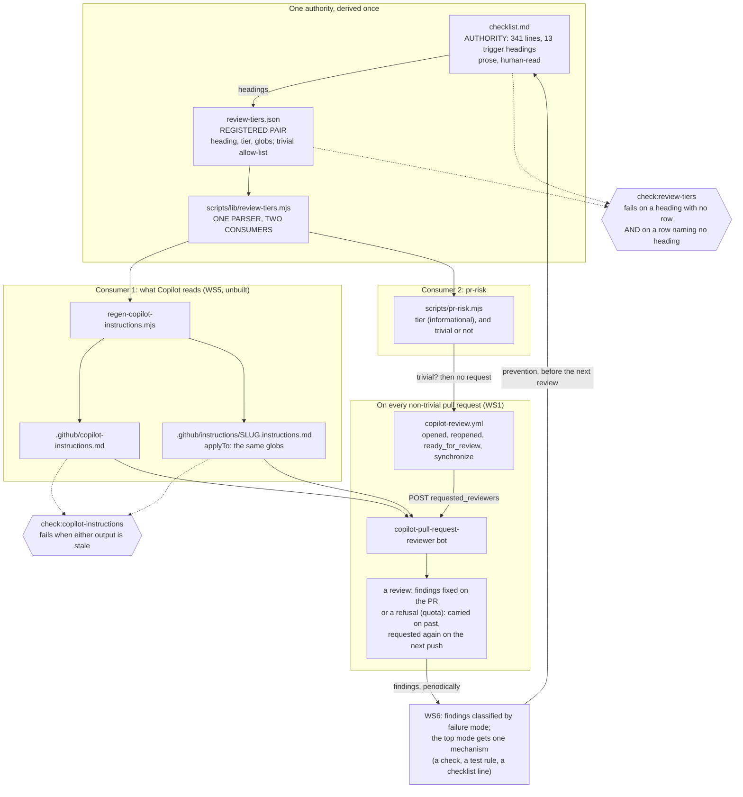

# Tiered PR review: Copilot on every non-trivial PR, and learning from what it finds

Status: WS1, WS2 and WS3 IMPLEMENTED. **WS4 WITHDRAWN** by the owner's
decision of 2026-09-23 (Open decision 6, resolved): Copilot reviews every
non-trivial pull request, nothing blocks on the review, and when Copilot
cannot review -- an exhausted quota -- work carries on without it. See
"The decision of 2026-09-23". WS5 is unbuilt. **WS6 is new** (barwise-1050):
classify what the reviews find by failure mode and prevent the most
common one upstream; its seed pass is done, its first mechanism is not.

WS1 (`.github/workflows/copilot-review.yml`) merged in #533. Its first
live run, on #534, settled the open question -- `GITHUB_TOKEN` CAN request
Copilot -- and went red anyway, on a readback that could never pass; see
WS1, "What the first live run found". Fixed in #534, along with a
refusal being counted as a review. WS3's measurement -- 55% of the last 20
merges high-risk, 70% of the last 40 -- stands as a description; with no
gate reading the tier, it is no longer a budget anything fails against.

Created: 2026-09-17
Last-updated: 2026-09-23
Tracking: barwise-1036 (WS1, the Copilot review workflow); barwise-1037 (WS2,
the tier table and its completeness gate); barwise-1038 (WS3, the
classifier); barwise-1041 (WS4, the blocking gate -- withdrawn); barwise-1040
(WS5, generated instructions and the measurement); barwise-1050 (WS6, the
failure-mode review). Closes nothing on its own.
The finding is barwise-953 (the instance: PR skills exist, are discoverable,
and are not invoked -- two recorded occurrences, and now the steady
state). Extends `docs/specs/pr-skills.spec.md`, which wrote the review
down, and applies `docs/specs/gate-refusal-contract.spec.md`, which is
the reason the gate here has three results instead of two.

In one sentence: every non-trivial pull request gets a Copilot review,
nothing blocks on it, and what the reviews keep finding is classified so
the most common failure can be prevented before review instead of fixed
after it.

_Until 2026-09-23 the sentence read differently:_ a path-derived tier was
to decide whether the review BLOCKS the merge, and a reviewer that could
not answer was to block too. The sections that argue that design are kept
as the record of it, each marked where the decision made it moot.

## The decision of 2026-09-23: review everything non-trivial, block nothing

The owner, after WS3 measured the high-risk tier at 55% of merges and
Open decision 6 laid out accepting it, narrowing it, or making blocking
cheap: "I don't think we need to manage the copilot reviews this
closely. Stick with the approach of reviewing all non trivial changes.
Keeps it simple. If we get a message saying that the [quota] has been
exceeded (or whatever that message is) then we can do our best without
it. We should be reviewing the
failure modes in those reviews so we get less rework over time."

What that settles:

- **No blocking gate.** WS4 is withdrawn. So are the gate's three-result
  contract, Open decision 1 (where a required check is enforced) and
  Open decision 3 (where a deep-review verdict is recorded for a gate to
  read): with nothing reading a verdict, none of them has a consumer.
- **A quota refusal is carried on past, not waited on.** Copilot posts
  its refusal as a review; nobody treats it as a finding or a blocker,
  and WS1 asks again on the next push. The steward skill carries this
  for whoever drives a pull request.
- **The tier stays, as information.** `pr-risk` still prints the tier and
  the checklist headings a diff triggers, for a person reading it and
  for WS5's path-scoped instructions. The trivial allow-list is the one
  part a workflow acts on.
- **Rework is the thing to reduce.** Every Copilot finding fixed on its
  pull request was written, found and rewritten. WS6 looks across the
  findings for the failure that recurs and puts a mechanism in front of
  it, so the next pull request does not carry it to review at all.

## Principle

**Define errors out of existence**, pointed at the review itself.

`pr-skills.spec.md` gave this repository a review discipline that works.
Its one run on PR #475 disproved the PR's own central behavioural claim
with a single CLI command -- the class of defect no gate in `ci.yml` can
reach. The discipline is not the problem.

The problem is that invoking it is a caller's responsibility. barwise-953
records two occurrences and states the remedy that was tried and failed:
"A restatement in prose that the skills should be run does NOT close this
-- that is what exists now, and it has a 0-for-2 record." Measured across
eight merged pull requests sampled on 2026-09-17, seven carry no recorded
review of any kind; the eighth is PR #475, the skill's own first run. Over
the preceding thirty days 216 pull requests merged, several within three
minutes of opening. The finding has stopped being an incident.

A caller who must remember to ask for a review is the failure case to
design away. The review becomes a thing that happens to a pull request
rather than a thing someone starts.

**Explicit over implicit** decides where the rules live. Copilot cannot
know barwise's invariants, and the 341 lines that state them already have
exactly one home in `pr-review/checklist.md`. Restating them for Copilot
creates the must-agree copy CLAUDE.md forbids, so the instructions
Copilot reads are generated from that file and a drift gate fails when
they diverge.

## Should the review gate trust a silent Copilot? (resolved: no -- it refuses; MOOT since 2026-09-23)

_Moot: there is no review gate (WS4 withdrawn). Kept as the record of
the design. One finding outlived it: a refusal is not a review. WS1's
"already reviewed" check counted Copilot's quota refusal as one until
2026-09-23, which is this section's false green one layer earlier._

A review check that passes when Copilot posted nothing is the defect
`gate-refusal-contract.spec.md` spent a month removing, one layer out.

Copilot reviewing a diff and finding nothing, and Copilot never running
because the request failed, the bot was unavailable, or the API read
returned empty, produce the same observable: no findings on the pull
request. A gate that reads "no findings" as "pass" prints PASS on a
question it never asked. That is barwise-906's shape -- six occurrences
-- and `audit-gate`'s false green, which is the one the fault matrix
caught.

So the gate has three results, the same three every other gate here has:

| Situation                                                    | Exit | Merge   |
| ------------------------------------------------------------ | ---: | ------- |
| Routine tier                                                 |    0 | allowed |
| High-risk tier, Copilot reviewed, no blocking finding        |    0 | allowed |
| High-risk tier, blocking finding open                        |    1 | blocked |
| Recorded barwise verdict is "cannot tell"                    |    1 | blocked |
| No Copilot review recorded, or the API could not be read     |    2 | blocked |
| Copilot responded that it could not review (quota exhausted) |    2 | blocked |

Exit 2 is not a failure of the pull request. It is the gate saying it
could not see its input, which is the signal that routes to a person --
and it is the only path in this design that pages one. The paper this
was argued from proposes calibrated abstention as the mitigation for
agent false negatives; this repository already built abstention for its
gates, and this spec extends it to the reviewer.

## Should the tier table live inside checklist.md? (resolved: no -- a registered pair)

`checklist.md`'s section headings already are the risk triggers: "When a
surface changed", "When `@barwise/core` changed", "When a skill, agent
brief, CLAUDE.md, AGENTS.md, or prompt artifact changed". What they lack
is a machine-readable path.

Putting globs into `checklist.md` keeps one owner at the cost of the
document a human actually reads. The alternative -- a table that names
the headings -- is a copy, so it gets the treatment CLAUDE.md prescribes
for copies: register the pair and make agreement loud. `review-tiers.json`
names each heading verbatim and carries its globs, and
`check:review-tiers` fails **both** on a heading with no row and on a row
naming a heading that no longer exists. That bidirectional shape is
`check:root-scripts`, which already fails both ways for the same reason.

One derivation then feeds two consumers: the tier classifier reads it to
report a tier (it was to decide whether a pull request blocks, until WS4
was withdrawn), and the Copilot instruction generator reads it to emit
path-scoped instructions. Two parsers over one
table would be the copy the rule forbids, so the table is parsed once in
`scripts/lib/review-tiers.mjs` -- the shape `lib/ci-gates.mjs` already
uses for `ci.yml`.

## What the live test measured (2026-09-18)

The precondition WS1 was blocked on is **settled positive**, and the same
run answered Open decision 2, falsified this spec's recommendation on it,
and surfaced a cost the design had not priced.

Copilot code review was requested on PRs #516 and #509 across two windows,
before and after the org's Copilot entitlement was enabled. Five responses
from `copilot-pull-request-reviewer[bot]`:

| Time (UTC) | PR   | Response                           |
| ---------- | ---- | ---------------------------------- |
| 01:33:08   | #516 | "unable to review ... quota limit" |
| 01:33:54   | #509 | "unable to review ... quota limit" |
| 01:34:00   | #516 | "unable to review ... quota limit" |
| 01:36:08   | #516 | "unable to review ... quota limit" |
| 01:39:34   | #516 | a real review                      |

**The false green this spec was written around occurred in the wild, four
times, within hours of it merging.** Those first four are `state:
COMMENTED` reviews authored by the reviewer bot. A gate asking "did
Copilot post a review on this head?" passes on every one of them. The
review says, in its own body, that it did not review. That is not a
hypothetical the refusal contract was guarding against -- it is the
observed default behaviour of this reviewer under a condition
(exhausted quota) that recurs monthly by construction.

**Open decision 2 is resolved, against this spec's own recommendation.**
The spec recommended treating `CHANGES_REQUESTED` as the blocking signal
and leaving comments advisory. That cannot work: **all five responses
carry `state: COMMENTED`**, including the real review, whose body opens
with an approval recommendation. Copilot does not vary its review state.
The signal is in the body, not the state, and a gate reading `state`
would have been reading a constant. The recommendation was made without a
corpus, and one run of the corpus disproved it.

What the body does carry, in the real review, is structure:

- A verdict line -- an approval recommendation, prefixed with a coloured
  status marker.
- A details block with `Files reviewed: 1/2 changed files`,
  `Comments generated: 0 new`, `Review effort level: Balanced`, and a
  `Files not reviewed` list naming each skipped file with a reason
  (`barwise/package-lock.json: Generated file`).

Copilot self-reports its own coverage. That is a stronger signal than
this spec designed for: the gate can detect a review that covered almost
nothing, not merely one that did not happen.

**It does not run your gates.** The real review recommended approval on
#516, whose CI has been red since 2026-09-12. A Copilot approval is
evidence a reviewer looked, never evidence the change is sound, which is
why the review job was to read tier, CI and review state together.

**The cost the design had not priced. (UNVERIFIED -- confirm before
acting on it.)** Secondary sources report that Copilot code review
carries a premium-request multiplier of 13 from 2026-06-01, and that on
private repositories it additionally consumes Actions minutes from the
same pool as CI. **This spec has not verified either figure**:
`docs.github.com` is unreachable from the session that wrote this
section (blocked by the network egress proxy), so the numbers come from
search-result summaries rather than from GitHub's billing documentation,
and no command in this repository reproduces them. Whether this
repository is private in GitHub's sense is also unestablished -- the
`"private": true` in `barwise/package.json` is the npm publish flag
and says nothing about repository visibility. (Established 2026-09-23:
it is public -- `curl -s https://api.github.com/repos/semantic-praxis/barwise
| jq '{private, visibility}'` prints `false` and `"public"` -- so the
Actions-minutes half of this concern does not apply.)

If the multiplier of 13 holds, then at this repository's measured rate
of 216 merged pull requests a month (`git log --merges --since="30 days
ago" --format="%s" | grep -c '^Merge pull request'`), "Copilot reviews
every pull request" is on the order of 2,800 premium requests a month
before a single Chat or agent call. That conditional is the whole of the
cost argument, and it rests on a number nobody here has checked against
its source. Verify it first; it may invert WS1's central choice.

_Superseded by the owner's decisions of 2026-09-23 (Open decision 5 and
"The decision of 2026-09-23"): the review cost is accepted, and the
multiplier now matters only for how early in a month the quota runs
out -- after which work carries on without the review._

## What WS3 measured (2026-09-22)

WS3's acceptance criterion: classify the last 20 merged pull requests,
and **if high-risk exceeds roughly a third, the globs are wrong and WS4
does not proceed.** It fired. The number is recorded here rather than
adjusted, because a budget moved to fit its measurement is not a budget.

Method, reproducible from any checkout:

```
git log --merges --format='%H %s' origin/main       # filter to 'Merge pull request #'
git diff --name-only <merge>^1...<merge>^2 > files.txt
npm run pr:risk -- --files files.txt --json
```

`--name-only` names only a rename's destination, which WS1's review
later showed can hide a change's real source. None of these 40 pull
requests contains a rename (`git diff --name-status` shows no `R` line
in any of them), so the numbers below stand; a re-run should use
`--name-status --no-renames`, as `pr-risk` itself now does.

Two things in that recipe were wrong on the first pass, and both inflate
the number:

- **Merges whose subject is not `Merge pull request #N` are base-syncs,
  not pull requests.** One was in the first sample.
- **Three dots, not two.** `git diff A B` compares two trees, so where
  the base moved while a pull request was open, the base's own commits
  appear as that pull request's changes. It affected 5 of 40 -- and two
  of those five were the pull requests first cited as evidence for
  narrowing the core row, which is how the error was found. `pr-risk`
  itself uses `base...HEAD` for exactly this reason, with a comment
  saying why; the measurement harness did not, so the comment sat in the
  one place that did not need it.

**The distribution, before and after fixing two rows:**

| Window      | high-risk before | high-risk after | budget |
| ----------- | ---------------- | --------------- | ------ |
| last 20 PRs | 12/20 (60%)      | 11/20 (55%)     | ~33%   |
| last 40 PRs | 29/40 (72%)      | 28/40 (70%)     | ~33%   |

Two windows because one window can be an artifact of what happened to be
worked on. It is not: the wider window is worse.

**Two rows were wrong, and the measurement is what showed it.** Both
were rows whose path stood in for something the path does not mean:

- **"When a dependency was added" fired on every `package.json` edit.**
  Of its 5 triggers in the last 20 pull requests, **4 added an npm
  script and nothing else** -- `check:review-tiers` (this spec's own WS2
  pull request), `check:secrets`, `audit:corrections`, and a `test`
  target. Over 40 pull requests it is 7 of 8. The globs are now the
  LOCKFILES (`package-lock.json`,
  `uv.lock`) and not the manifests: a dependency change is always written
  into the lock by `npm install` or `uv lock`, and CI rejects a lock that
  disagrees with its manifest, while a manifest edit on its own is almost
  always a script. The lock is a shadow of "a dependency changed" with a
  stated mechanism, and it diverges exactly where the mechanism is
  bypassed -- a hand-edited manifest with no install, which CI already
  refuses. Over the last 20 pull requests, 5 triggers became 1.

- **"When `@barwise/core` changed" fired on core's own tests.** Over 40
  pull requests, 4 of its 13 triggers touched nothing under `src/`:
  tests, core's own `CLAUDE.md`, and two mutation-testing configs. In
  the last 20 it is 1 of 2, which is why the wider window is quoted --
  one instance would not carry this. The glob is now
  `barwise/packages/core/src/` plus the package's `package.json`, since
  the exports map is a real API surface; a change to core's own tests is
  the tests row, which is routine.

  Against myself: **the `package.json` half of that glob has never
  fired.** It is in 0 of the 13 core triggers over 40 pull requests --
  reasoning, not measurement. If it is still unfired when WS4 is
  revisited, it should probably come out.

- **"When a skill, agent brief, CLAUDE.md, AGENTS.md, or prompt artifact
  changed" reached only the ROOT instruction files.** `CLAUDE.md` and
  `AGENTS.md` are exact paths, so 8 of the repository's 13 package-level
  `CLAUDE.md` files matched no glob on that row, and the other 5 reached
  a high-risk tier only incidentally -- `cli`, `mcp` and `vscode`
  through the surface row, `core` through the core row, `optimizer`
  through Python (routine). Narrowing the core glob above would have
  dropped `core/CLAUDE.md` to routine, which is how this surfaced: the
  audit of what the change DELETED, not the measurement. The row now
  names `barwise/packages/*/CLAUDE.md` and `barwise/optimizer/CLAUDE.md`
  explicitly. This is the only one of the three that made the tier
  WIDER; it moves the 40-PR figure from 68% to 70% and the 20-PR figure
  not at all.

  It is also the clearest case for the completeness gate WS2 shipped
  being insufficient on its own: `check:review-tiers` verifies that every
  heading HAS a row, and cannot see that a row's globs reach a fraction
  of what its heading claims. Filed as barwise-1046, with the three
  candidate mechanisms and the note that the cheap one -- refuse a glob
  matching zero tracked files -- would NOT have caught this, since
  `CLAUDE.md` does match the root file.

**The residual is not a glob defect.** After both fixes, high-risk is
still 55%, and two rows account for nearly all of it:

| Heading                                                    | PRs (of 20) | PRs (of 40) |
| ---------------------------------------------------------- | ----------- | ----------- |
| When a check, gate, hook, or script was added or changed   | 8           | 15          |
| When a skill, agent brief, CLAUDE.md, AGENTS.md, or prompt | 6           | 13          |
| When `@barwise/core` changed                               | 1           | 9           |
| When a surface changed (CLI, MCP, VS Code)                 | 1           | 4           |
| When a dependency was added                                | 1           | 1           |

Both leading rows are, on inspection, correctly tiered. A gate that stops
answering is this repository's most-repeated defect (barwise-906, six
occurrences), and an instruction file is logic with no test. Narrowing
either one would be narrowing it to hit a number.

So the finding is about the design's premise, not its globs. **The tier
design assumes changes that carry liability are a minority of changes.
In this repository they are the majority, because much of what this
repository produces IS its verification and instruction apparatus.** A
tier that fires on more than half of all pull requests does not triage;
it renames "every PR".

That is a question about how much review this repository wants, which is
Open decision 6, and not one the classifier can answer.

**What WS3 did not measure.** Whether the classification is CORRECT on
any given pull request -- only how often it says high-risk. A row can be
well-tiered and still be reached by the wrong paths, and nothing here
would show it. The three `not-path-derivable` groups are outside the
classifier entirely and stay with the deep review.

## Scope

In scope:

- When a NON-TRIVIAL pull request is opened, reopened, marked ready for
  review, or pushed to, and Copilot has neither reviewed it nor been
  requested, the system shall request a Copilot code review on it. A
  review whose body says Copilot was unable to review does not count as
  one.
- When `.github/copilot-instructions.md` or any file under
  `.github/instructions/` differs from its regenerator's output,
  `npm run check:copilot-instructions` shall exit 1 and name the stale
  file.
- When a regenerator or gate in this spec cannot read `checklist.md`,
  `review-tiers.json`, or the changed-file list, it shall exit 2 and
  shall not print a tier or a verdict.
- When a diff touches a glob in `review-tiers.json`, `scripts/pr-risk.mjs`
  shall classify the pull request as high-risk and print every triggering
  heading.
- When a heading in `checklist.md` has no row in `review-tiers.json`, or
  a row names a heading absent from `checklist.md`,
  `npm run check:review-tiers` shall exit 1.
- ~~When a high-risk pull request has no Copilot review recorded on its
  head commit, the review gate shall exit 2.~~ Withdrawn with WS4.
- ~~When a high-risk pull request carries an unresolved blocking finding,
  or a recorded barwise verdict of "cannot tell", the review gate shall
  exit 1.~~ Withdrawn with WS4.

Out of scope:

- **Running the `pr-review` skill in CI.** It needs a model, and a model
  needs a key, and `docs/specs/keyless-model-access.spec.md` removed the
  places a key can sit. Copilot is the keyless reviewer; the deep review
  stays a session activity whose verdict this gate reads. Revisit only if
  the measurement in WS5 shows generated instructions cannot carry the
  invariants.
- **Retiring any `ci.yml` gate.** Nothing here replaces a deterministic
  check. `checklist.md` is scoped by construction to what CI cannot reach.
- **Blocking a merge on the review.** Decided 2026-09-23: nothing blocks
  on Copilot, including when it cannot review.

## Inventory

| File                                    | Current state                                                        | Verdict                                                                                                                         |
| --------------------------------------- | -------------------------------------------------------------------- | ------------------------------------------------------------------------------------------------------------------------------- |
| `.claude/skills/pr-review/checklist.md` | 341 lines, 13 trigger headings, prose                                | authority; gains no globs, gains a completeness gate                                                                            |
| `.github/copilot-instructions.md`       | 31 hand-written lines, all about ORM tool usage, no review guidance  | becomes generated; current content is preserved as a hand-authored preamble section                                             |
| `.github/instructions/`                 | absent                                                               | new: one generated `*.instructions.md` per tier heading                                                                         |
| `.github/workflows/ci.yml`              | one `ci` job; inline path classification for docs-only and optimizer | untouched -- the `review` job it was to gain was WS4, withdrawn                                                                 |
| `barwise/scripts/lib/ci-gates.mjs`      | parses `ci.yml` into the gate list                                   | untouched; the model this spec copies                                                                                           |
| `barwise/parity.manifest.json`          | 8 declared sets, byte-checked                                        | untouched -- the generated pair is guarded by a regenerator and a drift gate, which the rule accepts in place of a manifest row |
| `barwise/audit-baseline.json`           | duplication ratchet                                                  | untouched, but WS3 must classify any candidate the new scripts raise                                                            |

Nothing in `packages/` changes. This spec touches repository process only,
which is why no workstream below runs the monorepo build for its own sake.

## Target architecture

The shape to check is the fan-out in the middle and the loop at the end:
one authority derived once into one parser that two consumers read, and
the reviews' findings feeding back into what authors check before review.
The blocking gate this diagram used to end in (WS4) is withdrawn.



The dotted edges are checks, not data flow: `check:review-tiers` reads
both `checklist.md` and `review-tiers.json` because it fails in both
directions, and `check:copilot-instructions` reads the generated outputs
to fail when they are stale. The loop from `LEARN` back to the checklist
is drawn to the checklist because that is the commonest landing place,
not the only one: a mechanism belongs wherever it stops the failure
earliest, and a check beats a line of prose that someone must remember.

## Alternatives considered

- **A hand-written `copilot-instructions.md` that restates the
  checklist.** Fastest, and it is the thing CLAUDE.md names as the
  failure: an unchecked must-agree copy. The checklist changes when an
  invariant is learned, and the copy would not, so Copilot would be
  reviewing against last month's rules with nothing to say so.

- **Blocking only on abstention, never on the tier.** Cheaper in merge
  latency and it still closes the false-green hole. Rejected by the
  requester in favour of blocking the whole high-risk tier: an open
  blocking finding on a change to `core`'s public API should not merge
  because the reviewer was confident about it. The cost is real and is
  stated in Risks.

- **Run `pr-review` in GitHub Actions via a model API.** Closes
  barwise-953 at the root with no reliance on Copilot absorbing generated
  instructions. It puts a second credential-holding lane in the
  repository against `keyless-model-access.spec.md`, which deliberately
  left exactly one. Held in reserve for WS5's measurement.

- **Enable automatic Copilot review in repository settings.** One toggle,
  no code. Invisible to the tree: nothing in a diff shows it exists, and
  no gate can assert it is still on. Rejected on the same ground the
  requester chose a workflow file.

- **Block nothing; review every non-trivial pull request. (CHOSEN
  2026-09-23.)** The simplest of the options, and the owner chose it for
  that. What it gives up is a guarantee that a finding is addressed
  before merge. On this spec's own pull requests every finding was
  addressed before merge without a gate, which is evidence the practice
  holds, not proof that it always will. See "The decision of 2026-09-23".

## Workstreams (each independently shippable)

**WS1 -- Copilot reviews every NON-TRIVIAL pull request.
(IMPLEMENTED 2026-09-23; request path unverified until first run.)**

_This paragraph used to say the precondition was not established._ It
was settled on 2026-09-18 (see "What the live test measured") and the
paragraph was never updated -- the status header said SETTLED while this
said NOT, in the same document, for five days. Recorded because it is
the same drift this spec's own reviews kept finding in other copies.

**The decision.** The owner, on 2026-09-23: "Copilot should fire for any
non trivial pr." Not every pull request, and not only the high-risk
tier -- which is the "gate requesting, not only blocking" inversion Open
decision 5 named as the budget fallback, taken on a narrower line.

**What trivial means, measured rather than chosen.** Of the 60 merged
pull requests #466 to #532, 11 (18%) changed only `.beads/issues.jsonl`,
every one of them as an edit, and nothing else was plausibly trivial.
The count, over the first-parent merges ending at `2f231119`:

```sh
for m in $(git log --first-parent --merges --format=%H -60 2f231119); do
  git diff --name-status --no-renames "$m^1...$m^2" | paste -sd' '
done | grep -cxF "$(printf 'M\t.beads/issues.jsonl')"    # prints 11
```

Documentation is deliberately NOT trivial: PR #532 was docs-and-tracker
only, and a Copilot review found five real defects in it, the worst a
spec diagram describing an implementation that no longer existed. So
trivial is an explicit allow-list, `trivial` in
`barwise/review-tiers.json` -- the authority for its entries and their
evidence -- read through `pr-risk.mjs`. A PR is trivial only if EVERY
change is an EDIT to a path on it. The entry is the file the evidence
measured, not `.beads/`: that directory also holds tracked, executable
git hooks. And only edits, because a rename's source path lies
elsewhere (code moved in under the tracker's name read as a closure by
name alone) and deleting the tracker is not a closure.

It is an allow-list and not derived from the tier rows because deriving
it is wrong in the direction that matters: the rows cover checklist
triggers, not the repository, so "no row but Every PR matched" would
read a change to `barwise/packages/diagram/src/` as trivial. An
unrecognised path must mean review it. A wrong skip is a defect nobody
looks at; a wrong request is one review's cost.

**The workflow's design, each choice stated where it lives:**

- `pull_request_target`, checking out the DEFAULT branch by name. The
  allow-list is read from main, so a PR cannot widen it to exempt
  itself -- under plain `pull_request` the checkout is the PR's own
  tree -- and a `workflow_dispatch` started from another branch reads
  main's table too, which the event's own ref would not. It also gives
  Dependabot PRs a token that can request a reviewer. No PR code is run;
  the only PR-controlled input is the changed-file records, read as
  data. A test pins the trigger, the checkout ref, and forbids checking
  out the PR head.
- The records travel as JSON, one per line (`pr-risk --changes`), not
  as bare names. JSON is the one line format in which every legal file
  name survives exactly, and it carries each file's status, which the
  edits-only rule needs. Nothing in `pr-risk` trims or normalises a
  path; a bare `--files` list with edge whitespace is refused, and one
  without status never reports trivial.
- One test decides who Copilot is, used by all three checks (past
  reviews, pending requests, the readback), so they cannot disagree.
- One review per PR. It runs on every push, but exits before checkout
  when Copilot has already reviewed or been requested, so a PR that
  starts tracker-only and later gains code is still reviewed once, and
  pushes do not buy repeat reviews.
- Every uncertainty resolves toward requesting: a files API call that
  fails, `pr-risk` refusing, an empty file list, and a list of 3,000
  files (where the API stops, so it may be truncated) all request the
  review. `isTrivial([])` is false for
  the same reason, because `[].every(...)` is true.
- A request that did not land fails the job, with the API response
  printed. A green job that requested nothing would be the
  absence-read-as-an-answer failure this repository keeps recording.
- `workflow_dispatch` runs it on an existing PR by number, to verify the
  request path or to backfill a PR opened before this existed.

**Verified before shipping, and kept verified:** the workflow's two
shell steps are cut out of the YAML by `gates.test.mjs` and run as
written against a stubbed `gh`, one case per branch -- draft, already
reviewed, a human and a deleted account's review, already requested,
fresh, a failed reviews read; a tracker edit (the one skip), the tracker
deleted, code renamed into its path, a hook beside it, two look-alike
names, tracker-plus-spec; a failed files read, a classifier refusal, an
empty list, 3,000 files, and a request that did not land (exit 1,
`::error::`, the evidence printed). The cases added after the first live
run are listed under "What the first live run found". This began as a one-off harness in
the session that wrote the workflow; a Copilot review then found four
defects in exactly the shell it had exercised, which is the argument
for the harness being a test rather than a transcript.

**What the Copilot review of #533 found.** Nine findings. Eight were
real as stated; the ninth, three spellings of Copilot's identity, was a
real inconsistency whose predicted failure did not occur, because the
reviews endpoint turned out to use the exact spelling checked. In full:
the allow-list wider than its evidence (`.beads/` rather than the
file); names trimmed, so ` .beads/issues.jsonl` became the tracker;
status discarded, so a rename or delete read as an edit; a failed files
read going red with no request, against the stated rule; the dispatch
checkout following the run's ref; three spellings of Copilot's identity;
the workflow header restating the allow-list it does not own; and this
section's count given without its command. Each fix has a test that a
mutation of it fails.

**And a mutation pass found the suite weaker than it looked.** Asked
whether testing the gate-level wiring should rest on remembering to, a
pilot enumerated every refusal site in `lib/review-tiers.mjs` and
`pr-risk.mjs` automatically and neutralized each: 8 caught, 8 survived,
8 unmeasurable. Seven survivors were in WS2 code already merged in #527,
one in this workstream's new code. Some guards no test reached; others
were reached by tests that asserted only exit 2, which a crash satisfies
as well as a designed refusal does, since the gate maps any exception to
2. Fixed here by asserting each refusal's own message; the same pass
afterwards reads 14 of 14 measurable sites caught in that file. The
mechanism -- automatic enumeration, occurrence-indexed anchoring, a
survivor ratchet -- is barwise-1049, because a pilot run once is the
remembering this was meant to replace.

**Not verifiable before shipping** (both since measured -- see "What the
first live run found"): whether `GITHUB_TOKEN` can request
`copilot-pull-request-reviewer[bot]`, and what login Copilot appears
under in the POST response. (The reviews endpoint's login WAS measured,
on #533's own review: `copilot-pull-request-reviewer[bot]`.) `docs.github.com` returned 403 through the
session's proxy and the container has no `gh`. The workflow reads the
response back and matches any requested reviewer containing "copilot",
case-insensitively -- deliberately loose about the spelling, which could
not be checked, and strict about the effect. If the first run goes red,
the printed response says which assumption was wrong. The fallback, if
`GITHUB_TOKEN` cannot request this reviewer at all, is a token the owner
creates and stores as a secret; that is not something a pull request
can do.

**What the first live run found (#534, 2026-09-23).** The first pull
request after #533 merged was non-trivial, and the workflow classified
it so, requested Copilot, and went RED: "The request returned without
error, but Copilot is not among the requested reviewers", with
`requested_reviewers: []` printed. The request had landed. The PR's event
history records it, and Copilot's review started 14 seconds later:

```sh
curl -s https://api.github.com/repos/semantic-praxis/barwise/issues/534/events \
  | jq -c '.[] | select(.event == "review_requested")
               | {created_at, actor: .actor.login, reviewer: .requested_reviewer.login}'
# {"created_at":"2026-09-23T20:04:40Z","actor":"github-actions[bot]","reviewer":"Copilot"}
```

So both unverifiable questions are answered: `GITHUB_TOKEN` can request
Copilot, and no owner-created token is needed; and Copilot appears in
the event history as `Copilot`, type `Bot`. What was wrong was the
readback's source. **`requested_reviewers` never lists Copilot**: it was
empty in the POST response, and `GET .../pulls/534/requested_reviewers`
was still empty while Copilot's review was visibly running. The same
field fed the "already requested" check, which therefore could never
fire; a push during the roughly eight minutes a review takes would have
requested a second one.

Both now read the event history. The readback counts Copilot's
`review_requested` events before and after the POST and passes only on
a NEW one, retrying briefly. "Already requested" means the latest Copilot
request is newer than every removal and every Copilot answer (real or
refusal) and under an hour old, so a request Copilot never answers does
not stop the next push from asking. Tested: requested and unanswered,
requested then removed, requested two hours ago, a team request with a
null reviewer, requested and answered by a refusal, a failed events read,
and a lost request whose only matching event is an old one. Seven
mutations, one per rule, each caught by the test written for it. The
harness's fake `gh` no longer answers the reviewer-list endpoint, so a
future read of it fails the tests instead of passing on a field that is
always empty.

Found the only way it could have been, by running it: the readback's
wrong assumption was named in this section before shipping, and the
design's answer -- fail loudly, print the evidence -- is what turned a
silent never-fires into a red job with the empty list on screen.

**A refusal is not a review (fixed 2026-09-23).** The first version
counted any review by the Copilot bot as "already reviewed". Copilot
posts its quota refusal AS a review -- same bot, same `COMMENTED` state --
so a pull request whose request met an empty quota was never asked
again. The check now ignores a review whose body says Copilot "was
unable to review this pull request", the text measured on #516. The next
push requests again; while the quota stays empty each push draws one
more refusal, which is visible and costs nothing. Found while answering a
question about Open decision 6, not by a test: every review in the
harness was a real one. It now has a refusal case and a
refusal-then-review case, and a mutation that counts refusals again fails
the first.

Acceptance, unchanged in substance: a non-trivial pull request opened
after this lands carries a Copilot review, observed, with the request
visible in the workflow log -- and a tracker-only one carries none, with
the skip visible in its log.

**WS2 -- The tier table and its completeness gate. (IMPLEMENTED
2026-09-18.)** `barwise/review-tiers.json`, `scripts/lib/review-tiers.mjs`,
`scripts/check-review-tiers.mjs`, `npm run check:review-tiers`, wired into
`ci.yml` so `ci-local` derives it. Seven tests in
`scripts/tests/gates.test.mjs`. The acceptance criterion was met: the gate
was watched going red on the real files first -- exit 1 on a planted
heading with no row, exit 1 on a renamed heading leaving a stale row,
exit 2 on a checklist moved out of reach (moved rather than chmod, since
the session runs as root and 000 does not stop it) -- each exit status
read directly with nothing in between, then the checklist restored
byte-identical and the gate green again. The tests pin the same four
readings against fixtures, through `--checklist`/`--table` overrides that
exist so the suite never perturbs the live checklist.

**What WS2 found that this spec assumed away: three of thirteen headings
are not path-shaped.** "When a type was introduced, or a field's type
chosen", "When a module, function, or interface was introduced, or a
signature widened" and "When a copy was added or a copy was edited"
trigger on what a hunk DOES, not where it lives; a copy is a relation
between two files, which no single-path glob expresses. Forcing them a
glob would mean matching every `.ts` file, making almost every code
change high-risk and blowing WS3's distribution budget on a rule nobody
believes. They carry tier `not-path-derivable` instead: the row exists so
the completeness gate still accounts for the heading, and the tier says
in the artifact that the classifier cannot reach it and the deep review
still owns it. This is the spec's "explicit over implicit" rather than a
gap -- but it does mean the tier can never be the whole of the checklist,
and WS4 must not read a routine classification as "the checklist is
satisfied".

**WS3 -- The classifier. (IMPLEMENTED 2026-09-22.)**
`scripts/pr-risk.mjs` over `review-tiers.mjs`, `npm run pr:risk`, and
fifteen tests in `scripts/tests/gates.test.mjs` (`expected-counts.json`
138 -> 153). It prints the tier and every
triggering heading with the files that triggered it, so the verdict can
be checked against the diff rather than trusted. Exit 0 classified, exit
2 could not; **there is deliberately no exit 1**, because a high-risk
tier is an answer and the gate contract above lets such a pull request
merge on a clean review -- mapping the tier onto the exit status would
put the classifier at odds with the gate that reads it.

Not wired into `ci.yml`, and now it will not be: its tier fed WS4, which
is withdrawn. Its one consumer that acts is WS1, which reads the
`trivial` field; the tier is information for a person reading the
output.

The acceptance criterion FIRED: see "What WS3 measured". 55% high-risk
against a budget of roughly a third, so **WS4 does not proceed.** Two
rows were genuinely wrong and are fixed; the residual is Open decision 6,
resolved on 2026-09-23 by withdrawing WS4, which leaves the budget nothing
to guard.

**What WS3 found that this spec assumed away, twice over:**

_The patterns are not globs._ The table's `globs` field holds four
shapes -- `**`, a directory prefix, a one-segment `*`, an exact path --
and `lib/review-tiers.mjs` now says so and refuses anything else, because
a shape like `*.ts` parses, matches nothing, and sits in the table
looking like a rule. Node's `path.matchesGlob` was the obvious
implementation and is NOT used: measured over this repository, 25
distinct patterns against 1637 tracked files, it disagrees on 73 of
40,925 comparisons, and every disagreement is a path with a dot-segment
that its wildcards decline to match. It would have silently emptied the
"Every PR" row of 71 files -- all of `.beads/`, `.claude/`, `.github/`
and `.husky/` -- and taken `.vscodeignore` out of the high-risk surface
row. A classifier reading fewer files than it claims while printing a
confident tier is barwise-905's shape exactly. It is also experimental in
the Node `.nvmrc` pins, so its semantics can move under a runtime
upgrade.

_An empty changed-file list is a refusal._ It classifies as `routine`
under any rule, and `routine` is also what a git call about the wrong
tree produces. A pull request changing no files does not occur here, so
an empty list means the question was never asked.

**WS4 -- The blocking gate. WITHDRAWN 2026-09-23 (Open decision 6).** It
was to add a `review` job to `ci.yml` that read each pull request's
reviews and held a high-risk one until Copilot had reviewed it with no
blocking finding. The owner decided against blocking at all: every
non-trivial pull request is reviewed, nothing waits on the review, and a
quota refusal is carried on past. barwise-1041 is closed as withdrawn.

If blocking is ever reconsidered, two things here carry over. The
three-result contract ("Should the review gate trust a silent Copilot?"),
because a quota refusal is the reviewer's normal failure mode, not an
edge case. And WS2's point that **a routine classification does NOT
mean the checklist is satisfied**: three groups are outside the
classifier's reach, and `pr-risk` prints them with every verdict for
that reason.

**WS5 -- Generated Copilot instructions, and the measurement that decides
whether they work (provisional: not yet grounded).** Add
`scripts/regen-copilot-instructions.mjs` and
`npm run check:copilot-instructions`. The generated instructions cannot
be unit-tested -- the reviewer is a third party and its output is not
deterministic -- so this workstream's real deliverable is a measurement:
plant a known checklist violation in a scratch pull request, one per
tier heading, and record whether Copilot flags it. A heading Copilot
misses is a heading the deep review still owns, recorded in this spec
rather than assumed away.

**WS6 -- Learn from what the reviews find. (NEW 2026-09-23; seed pass
done, first mechanism not yet chosen.)** The owner: "We should be
reviewing the failure modes in those reviews so we get less rework over
time." A Copilot finding fixed on its pull request is rework -- the defect
was written, found, and written again -- and fixing each one where it
lands does nothing about the next. WS6 reads the findings as a corpus.

The method, kept small on purpose:

1. Collect every Copilot inline finding on the pull requests merged since
   the last pass.
2. Put each in one failure mode. Use the five below; add a mode only when
   a finding fits none of them.
3. For the mode with the most findings, land ONE mechanism that would
   have stopped most of them before review -- a check, a test rule, a
   skill or checklist line -- and record which.
4. The next pass reads whether that mode's share fell.

Roughly monthly, or sooner once about twenty reviewed pull requests have
merged. **Do not gate on the counts.** How many findings Copilot posts is
a shadow of how much rework there is: it moves with the review's effort
level, the diff's size and Copilot's own variance. The counts choose the
next mechanism; they are not a target.

**The seed pass: 25 findings on #531, #532 and #533**, this spec's own
pull requests of 2026-09-22 and -23. One finding per thread as Copilot
posted them, so #533's trimming defect, posted once per file, counts
twice. Read through the GitHub MCP tools; the `gh` spelling below returns
the same comments but was not itself run here:

```sh
for n in 531 532 533; do
  gh api --paginate repos/semantic-praxis/barwise/pulls/$n/comments \
    --jq '.[] | select(.in_reply_to_id == null)
              | select(.user.login | ascii_downcase | contains("copilot")) | .body'
done
```

| Failure mode                              | #531 | #532 | #533 | Total |
| ----------------------------------------- | ---: | ---: | ---: | ----: |
| A fact restated elsewhere went stale      |    4 |    2 |    3 |     9 |
| An input at a boundary was not handled    |    2 |    0 |    4 |     6 |
| A claim went wider than its evidence      |    0 |    3 |    2 |     5 |
| A failure or secondary path was not built |    1 |    0 |    2 |     3 |
| A test missed what it claimed to test     |    2 |    0 |    0 |     2 |
| Total                                     |    9 |    5 |   11 |    25 |

Each finding, so the classification can be argued with:

- _Stale restated fact (9):_ #531's tracker note kept superseded counts;
  #531's README still said the edge tag never moves; #531's spec Status
  said "unbuilt" for a shipped change; #531's spec said ten tests where
  there were eleven; #532's Status was updated but three passages below
  it were not; #532's diagram still showed the step order the previous
  review had changed; #533's workflow spelled Copilot's identity three
  ways; #533's workflow header restated the allow-list it does not own;
  #533's tracker note kept the superseded allow-list unmarked.
- _Boundary input (6):_ #531's pattern language accepted `.` and `..`
  segments; #531's flag with no value fell back to a default; #533
  trimmed file names, so a leading space made another file the tracker
  (two threads); #533 dropped each file's change status, so a rename or
  delete read as an edit; #533's `..` substring test refused legal names
  once names arrived exactly.
- _Claim wider than evidence (5):_ #532 evidenced "a plain `git pull`
  works" with `git fetch`, in the spec and the tracker (two threads);
  #532 gave release positions and timestamps with no command; #533's
  allow-list was wider than the file its evidence measured; #533 gave 11
  of 60 without the command that counted it.
- _Failure or secondary path (3):_ #531 moved the tag before uploading,
  so a failed upload left it naming the wrong artifacts; #533's failed
  files API call ended the job with no request, against its own rule;
  #533's manual run checked out whatever branch it was started from.
- _Test missed its target (2):_ #531 tested new validation only by
  calling the helper, not through the gate; #531 had a refusal test that
  passed for a different reason than the one it named.

What it shows, with the caveat that three pull requests from one author
on one spec is a hypothesis, not a finding: **the stale restated fact is
the largest mode, 9 of 25, and the only one in all three pull requests.**
Every instance has one shape -- a fact written in more than one place,
and a change that updated only some of the copies. CLAUDE.md's
must-agree rule covers copies in code; these are copies in prose (tracker
notes, a spec's Status line and counts, the README, a comment restating
config), and nothing checks them.

**Proposed first mechanism, for that mode -- not landed; the owner's
call.** Write each fact once and point to it everywhere else. A tracker
note records the verdict and a pointer ("see the spec, WS3") rather than
the spec's counts; a PR body links the spec section rather than copying
its figures; a workflow comment names its config file rather than
listing the entries. That removes the copies instead of checking them,
and most of the nine would never have been written. It would go in the
`pr-creation` skill as an authoring rule, with one line in
`checklist.md`'s "Every PR" group so a reviewer can hold an author to it.
A check would be stronger than a line of prose, and none is proposed
because none is known that works on prose: a checker cannot tell a
restated fact from two numbers that happen to be equal. If the next pass
shows the mode holding its share, that is the signal to look for one.

Pass log:

| Pass | Date       | Window           | Findings | Top mode                | Mechanism            |
| ---- | ---------- | ---------------- | -------: | ----------------------- | -------------------- |
| seed | 2026-09-23 | #531, #532, #533 |       25 | stale restated fact (9) | proposed, not landed |

Acceptance: a pass is recorded here with its window, per-mode counts and
the command that collected them; the mechanism chosen for its top mode is
landed; and the next pass records whether that mode's share fell.

Coupling: WS3 depends on WS2, and WS1 reads WS3's trivial allow-list.
WS5 and WS6 both draw on WS1's reviews and are independent of each
other: WS5 changes what Copilot is told to look for, WS6 changes what
authors do before a review happens.

## Risks

**Blocking the tier makes roughly one or two pull requests a day wait.
(RESOLVED 2026-09-23 by blocking nothing; kept as the record.)**
At 216 merges in thirty days, a tier catching a third of them is about
two per day held until a review is recorded. That is the requester's
decision and the point of the design, but it is also the shape that gets
gates disabled. WS3's distribution check exists to catch a tier that is
too wide before WS4 makes it binding.

**It caught one (2026-09-22).** Not a third: 55% of the last 20 merges
and 70% of the last 40, which at this merge rate is about four pull
requests a day, not two. The risk this paragraph describes is therefore
the live state of the design rather than a thing to watch for, and WS4
was blocked on Open decision 6 until the owner withdrew it. Worth noting which
way the check was useful: it did not find the globs sloppy, it found the
premise wrong, and a check that can only report "too wide, narrow it"
would have been answered by narrowing rows that are correctly tiered.

**Copilot finding nothing is a shadow, not a property.** It correlates
with the diff being clean through a mechanism -- Copilot read the diff
and had an opinion -- and diverges exactly where the mechanism is bypassed:
instructions too long to absorb, a pointer to `checklist.md` it did not
follow, a diff too large for its context. With no gate, nothing even
checks that Copilot _answered_, and nothing verifies it answered _well_.
A clean review is a reviewer's opinion, not evidence the change is
sound. WS5 is the instrument for the second question, and its findings
belong in this spec, not in a comment.

**The whole design rests on a third-party capability this spec has not
seen work. (RESOLVED: it has.)** Copilot reviewed #516 on 2026-09-18
after four quota refusals ("What the live test measured"), and reviewed
#531, #532 and #533 (twice) with findings nearly all real. What is still
unseen is WS1's workflow requesting a review on its own; that is WS1's
acceptance.

**The quota runs out, and reviews stop for the rest of the month.** A
refusal is visible on the pull request and costs nothing, and the
owner's policy is to carry on without the review. The cost is the
review that did not happen: pull requests merged in that window got no
second reader. WS1 asks again on the next push, so a pull request still
open when the quota resets is reviewed then; one merged before it is
not, and nothing goes back for it.

**Prompt injection reaches the reviewer.** Copilot reads diff content,
and a pull request can contain text addressed to it. This is an
unsolved class, acknowledged as such in the literature. It bounds what
a review may be taken to mean: evidence that a review happened, never
authority to merge. Every merge ends at a human, which is what keeps
that bound meaningful.

## Open decisions

1. **(MOOT 2026-09-23: there is no review check to require, since WS4 is
   withdrawn.)** **Where required-check enforcement is recorded.** Branch protection is
   a repository setting; nothing in the tree shows it exists or is still
   on -- the objection that decided WS1's mechanism. Options: (a) accept
   it and document it in CLAUDE.md; (b) add a gate that reads the
   repository ruleset through the API and fails when the `review` check
   is not required. **Recommended: (b).** The repository's own standard
   is that a convention with no check is not landed, and (a) recreates
   for enforcement the exact hole the requester rejected for Copilot.
   The cost is a gate that needs network and a token, so it refuses with
   exit 2 offline -- which is the contract working, not a defect.

2. **What counts as a blocking finding from Copilot. (RESOLVED
   2026-09-18, against this spec's own recommendation.)** The
   recommendation was (b): treat `CHANGES_REQUESTED` as blocking, leave
   comments advisory. Measurement disproved it -- Copilot returns
   `state: COMMENTED` invariantly, including on the review whose body
   recommends approval and on the four that say it could not review. A
   gate reading `state` reads a constant. The signal is the body's
   verdict line, and the `Files reviewed: N/M` and `Files not reviewed`
   fields beside it. WS4 parses the body; it must not branch on review
   state. See "What the live test measured". (WS4 is withdrawn; the
   finding still governs WS1, which reads the body to tell a quota
   refusal from a review.)

3. **(MOOT 2026-09-23: no gate reads a verdict, since WS4 is
   withdrawn.)** **Where a barwise deep-review verdict is recorded so a gate can read
   it.** The "cannot tell" row needs a machine-readable home. Options:
   (a) a review posted through the API whose first line carries the
   verdict, parsed by the gate; (b) a `review-verdict.json` committed to
   the branch; (c) a label. **Recommended: (a).** The `pr-review` skill
   already specifies the recommendation as the first line of the review
   body, so the format exists and needs no second authority -- but it
   makes the gate a parser of prose, which is the weak part of the
   recommendation and the reason this is open rather than decided.

4. **Whether `.github/instructions/*.instructions.md` path-scoped
   instructions are supported by Copilot code review at the time WS5
   lands.** The mechanism is documented for Copilot, and its `applyTo`
   globs map onto the tier table exactly, which is why the architecture
   reaches for it. It is a third-party capability and this spec has not
   verified it. WS5 grounds it first and falls back to a single generated
   `copilot-instructions.md` if path scoping is unavailable.

5. **(Cost half DECIDED 2026-09-23: request on every non-trivial pull
   request -- see WS1. At the measured 82% non-trivial and ~216 merges a
   month that is roughly 177 reviews; the premium-request multiplier
   that would turn that into a bill is STILL UNVERIFIED, so the monthly
   cost is not known, only its driver.)** Which model tier reviews, and whether the tier gates requesting as
   well as blocking.** Published figures for the GPT-5.6 family: Sol
   $5/$30 per 1M tokens, Terminal-Bench 2.1 88.8%, Nerova 79.2%; Terra
   $2.50/$15, 87.1%, 71.4%; Luna $1/$6, 83.2%, 41.3%. Context is 1.05M on
   all three, so the instruction-absorption risk this spec worried about
   -- 341 checklist lines plus generated instructions -- does not
   discriminate between them. (Figures as supplied by the repository
   owner from the model picker, 2026-09-18; not independently verified
   against a vendor publication.) **The model half is DECIDED as of
   2026-09-18: the org Copilot policy enables only GPT-5.6 Terra.** That
   also closes the model-provenance gap by construction -- if only Terra
   can run, every Copilot review was Terra, and WS4 never needs to assert
   it. The closure is an INFERENCE, not an observation: it holds only if
   code review honours the org model policy, which is unverified, and the
   review body does not name the model, so the artifact cannot settle it
   either way. The cost half below stays open. **Recommended: Terra.** Luna is
   disqualified by the SPREAD rather than by either score: it trails
   Terra by 3.9 points on Terminal-Bench and by 30.1 on Nerova, and two
   benchmarks disagreeing by 26 points about the same model means one of
   them is insensitive to something Luna lacks. Which one is relevant to
   reviewing a diff against a written checklist is not established here
   -- what this spec has is the shape, not a reading of Nerova -- and a
   reviewer that gates merges is the wrong place to bet on the
   optimistic benchmark. Terra is within 1.7 points of Sol on
   Terminal-Bench at half the token price.

   Two things this recommendation does NOT settle. First, Copilot bills
   by premium request with a per-model multiplier, not by token, so the
   prices above may not drive Copilot cost at all -- confirm whether the
   13x code-review multiplier varies by tier before treating Terra as
   the cheap option. Second, at 13x and roughly 216 merged pull requests
   a month, reviewing every pull request is on the order of 2,800
   premium requests monthly; if that is not affordable, the tier must
   gate **requesting** and not only blocking, which inverts WS1's
   "every pull request" premise. That is the decision, and it is a
   budget question this spec cannot answer. (Answered 2026-09-23: every
   non-trivial pull request, and the multiplier now decides only how
   early in a month the quota runs out -- see Risks.)

   WS5 settles the capability half empirically: run the planted
   checklist violations at Terra and at Luna and compare. The benchmarks
   say Luna is risky; only WS5 says whether that matters for these
   invariants.

6. **The tier fires on 55% of merges, not a third. Narrow it, accept it,
   or change what "blocking" costs?** (RESOLVED 2026-09-23: none of the
   three -- nothing blocks.)

   **The resolution.** The owner went simpler than any of the options
   below: review every non-trivial pull request, block nothing, carry on
   without the review when the quota is exhausted, and study what the
   reviews find to reduce rework (WS6). WS4 is withdrawn, so the tier no
   longer has a budget to exceed; the 55% stands as a description of
   this repository. The options are kept as the record of what was
   weighed.

   One thing had changed by the time the decision was taken, and the
   text below predates it: WS1 was already requesting a review on every
   non-trivial pull request, so blocking would have bought no extra
   reviews -- only waiting, fix rounds, and a merge freeze whenever the
   quota ran out. That is what made "block nothing" the cheap choice
   rather than the careless one.

   WS3 measured it and the two glob defects it found are fixed; the
   residual is the design's premise, not its patterns. Two rows produce
   almost all of it -- "a check, gate, hook, or script" (8 of the last
   20 merges, 15 of the last 40) and "a skill, agent brief, CLAUDE.md,
   AGENTS.md, or prompt artifact" (6 and 13) -- and both are, on
   inspection, tiered correctly. A gate that stops answering is this
   repository's most-repeated defect; an instruction file is logic with
   no test. The measurement is not telling us the globs are sloppy. It
   is telling us that in a repository whose output is substantially its
   own apparatus, the changes that carry liability ARE the bulk of the
   changes.

   Three ways out, and they are genuinely different bets:

   **(a) Accept 55% and let it block.** Honest to the risk, and the
   design does what it says. Costs roughly one pull request in two
   waiting on a recorded review -- at 216 merges a month, about four a
   day. The Risks section already names this as the shape that gets
   gates turned off, and at 55% the tier has stopped triaging and is
   close to "every PR" under another name.

   **(b) Narrow the two rows until the budget is met.** Cheapest to do
   and the worst reason to do it: it would mean deciding that gate code
   and instruction files are low-risk because there is too much of them,
   which is fitting the measure to the target. If it is done at all it
   needs a reason that survives being written down -- for instance that
   `barwise/scripts/tests/` is test work rather than apparatus work,
   which is arguable and worth one measured pass, but it moves 1 of 20.

   **(c) Change what the high-risk tier COSTS, instead of its size.**
   Keep the tiers honest and make blocking cheap enough to apply to
   55% -- which is the WS1 cost question from Open decision 5 arriving
   from the other direction. If a Copilot review is affordable on every
   pull request and usually clean, a 55% blocking tier is a few minutes
   of latency, not a queue. If it is not affordable, then neither (a)
   nor this is available and the answer is (b) or no WS4 at all.

   These are not independent: **(c) cannot be evaluated until the
   premium-request multiplier in Open decision 5 is confirmed.** That is
   the one external fact both open decisions now turn on, and it is a
   lookup rather than a judgment.

   Recommendation at the time: do not start WS4. Confirm the multiplier, then choose
   between (a)/(c) and (b) with the cost in hand. WS1 and WS5 are
   unaffected and can proceed meanwhile -- WS5's planted-violation
   measurement is worth more before a gate exists than after.
